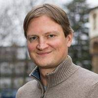

 

Speaker: **Alexander Tkatchenko**, Professor of Physics, University of Luxembourg

**Abstract:**  
Machine Learning Force Fields (MLFF) should be accurate, efficient, and applicable to molecules, materials, and interfaces thereof. The first step toward ensuring broad applicability and reliability of MLFFs requires a robust conceptual understanding of how to map interacting electrons to interacting “atoms”. Here I discuss two aspects: (1) how electronic interactions are mapped to atoms with a critique of the “electronic nearsightedness” principle, and (2) our developments of symmetry-adapted gradient-domain machine learning (sGDML) framework for MLFFs generally applicable for modeling of molecules, materials, and their interfaces. I highlight the key importance of bridging fundamental physical priors and conservation laws with the flexibility of non-linear ML regressors to achieve the challenging goal of constructing chemically-accurate force fields for a broad set of systems. Applications of sGDML will be presented for small and large (bio/DNA) molecules, pristine and realistic solids, and interfaces between molecules and 2D materials.

For more information, see references: Sci. Adv. 3, e1603015 (2017); Nat. Commun. 9, 3887 (2018); Comp. Phys. Comm. 240, 38 (2019); J. Chem. Phys. 150, 114102 (2019); Sci. Adv. 5, eaax0024 (2019).

**Bio**  
Alexandre Tkatchenko is a professor at the Department of Physics and Materials Science (and head of this department since January 2020) at the University of Luxembourg, where he holds a chair in Theoretical Chemical Physics. Tkatchenko also holds a distinguished visiting professor position at the Berlin Big Data Centre (BBDC) of the Technical University of Berlin. His group develops accurate and efficient first-principles computational models to study a wide range of complex materials, aiming at qualitative understanding and quantitative prediction of their structural, cohesive, electronic, and optical properties at the atomic scale and beyond. He has delivered more than 250 invited talks, seminars and colloquia worldwide, published 180 articles in prestigious journals (h-index of 67 with more than 22,000 citations; Top 1% ISI highly cited researcher in 2018-2020), and serves on the editorial boards of Science Advances and Physical Review Letters. Tkatchenko has received a number of awards, including APS Fellow from the American Physical Society, Gerhard Ertl Young Investigator Award of the German Physical Society, Dirac Medal from the World Association of Theoretical and Computational Chemists (WATOC), van der Waals prize of ICNI-2021, and three flagship grants from the European Research Council: a Starting Grant in 2011, a Consolidator Grant in 2017, and Proof-of-Concept Grant in 2020.

<a class="radius button small" href="https://drive.google.com/file/d/1nOuQ4naUpI4C0ee85xJQ_WAe_qk1MDhk/view?usp=sharing">Watch Back ›</a>

[1]: https://bereau.group/
[2]: /blog/
[9]: /contact/
[3]:https://github.com/undark-lab/swyft
[4]:https://arxiv.org/abs/2011.13951
[5]:http://www.mathben.com/
[6]:https://pubs.acs.org/doi/10.1021/acs.jctc.0c00981
[7]:https://github.com/Ensing-Laboratory/FABULOUS
