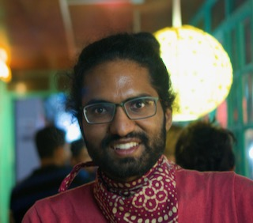

#### Interpretability and Out of Distribution Generalization in Deep Predictive Models

 

Speaker: **Rajesh Ranganath**, NYU

**Abstract:**  

Interpretability enriches what can be gleaned from a good predictive
model. Techniques that learn-to-explain have arisen because they
require only a single evaluation of a model to provide an
interpretation. In the first part of this talk, I will discuss a flaw
with several methods that learn-to-explain: the optimal explainer
makes the prediction rather than highlighting the inputs that are
useful for prediction. I will also describe an evaluation technique
that can detect when the explainer makes the prediction along with a
new method that learns-to-explain without this issue.
In the second part of my talk, I will discuss our work on
representation learning for out of distribution generalization. I will
construct a family of representations that generalize when under
changing  nuisance-induced spurious correlations and have applications
to images and chest X-rays. I will show how nuisance variables can be
constructed using limited prior knowledge and augmentations of the input.

Bio:
Rajesh Ranganath is an assistant professor at NYU's Courant Institute
of Mathematical Sciences and the Center for Data Science. He is also
affiliate faculty at the Department of Population Health at NYUMC. His
research focuses on approximate inference, causal inference,
probabilistic models,  and machine learning for healthcare. Rajesh
completed his PhD at Princeton and BS and MS from Stanford University.
Rajesh has won several awards including the NDSEG graduate fellowship,
the Porter Ogden Jacobus Fellowship, given to the top four doctoral
students at Princeton University, and the Savage Award in Theory and
Methods.

This meeting was not recorded.
<!---
<a class="radius button small" href="https://drive.google.com/file/d/1PryMUuxAw09Flpfa9J0Z7m4cQexa3Q5G/view?usp=sharing">Watch Back ›</a>
--> 

[1]: https://bereau.group/
[2]: /blog/
[9]: /contact/
[3]:https://github.com/undark-lab/swyft
[4]:https://arxiv.org/abs/2011.13951
[5]:http://www.mathben.com/
[6]:https://pubs.acs.org/doi/10.1021/acs.jctc.0c00981
[7]:https://github.com/Ensing-Laboratory/FABULOUS
[8]:www.evozyne.com
