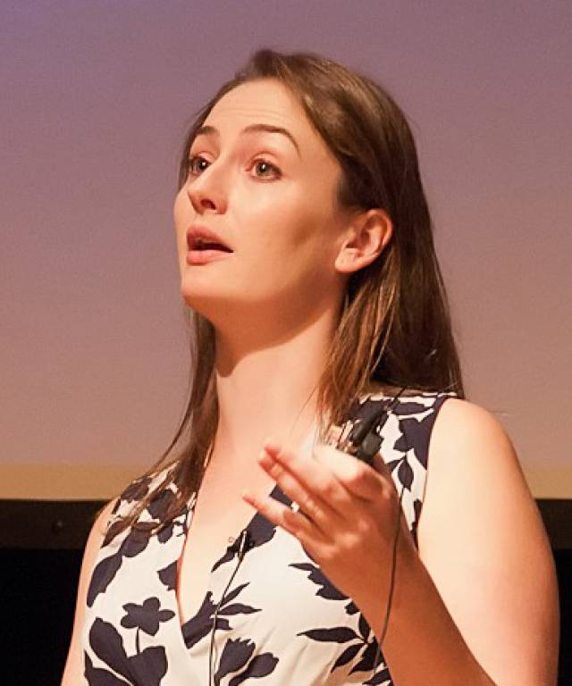

#### Catalogue curation, likelihood misspecification and dataset shift: challenges for Bayesian deep-learning in radio astronomy

Date: 29-03-2022 14:00-1500 Central European Summer time

 

Speaker: **Anna Scaife**, Professor of Radio Astronomy at the University of Manchester and Head of the Jodrell Bank Centre for Astrophysics Interferometry Centre of Excellence

**Abstract:**  

Understanding the selection biases introduced by AI models in scientific analysis and extracting well-calibrated uncertainties on machine learning outputs are two key challenges facing the systematic use of such algorithms in radio astronomy. I this talk I will discuss our recent work on uncertainty calibration for radio galaxy classification including how the use of group-equivariant convolutions can correct effects of bias in model outputs, as well as how data curation in astronomy catalogues can cause likelihood misspecification in Bayesian deep-learning. I will go on to talk about how the effect of data curation can also affect the use of semi-supervised learning that leverages large unlabelled datasets - highly relevant for radio astronomy applications where the volume of labelled catalogue data is small, but the quantity of archival survey data is large.

**Bio:** 
Anna is currently Professor of Radio Astronomy at Jodrell Bank Centre for Astrophysics and academic Co-Director of Policy@Manchester at the University of Manchester. Previously she has worked at the University of Southampton (UK), the Dublin Institute for Advanced Studies (Ireland) and the University of Cambridge (UK). She has a PhD from the University of Cambridge and an undergraduate degree from the University of Bristol.

<a class="radius button small" href="https://drive.google.com/file/d/11usK-95DvkjC7WG7IyzdQnh2hTd2KmuG/view?usp=sharing">Watch Back ›</a>

[1]: https://bereau.group/
[2]: /blog/
[9]: /contact/
[3]:https://github.com/undark-lab/swyft
[4]:https://arxiv.org/abs/2011.13951
[5]:http://www.mathben.com/
[6]:https://pubs.acs.org/doi/10.1021/acs.jctc.0c00981
[7]:https://github.com/Ensing-Laboratory/FABULOUS
[8]:www.evozyne.com
