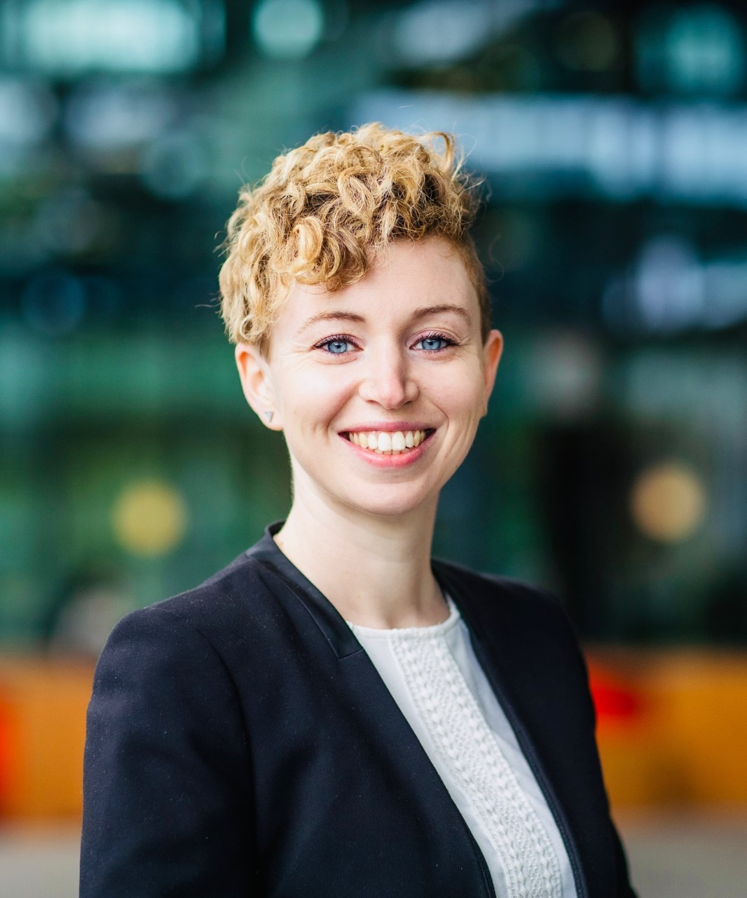

Time: 14:00-1500 Central European Summer time

 

Speaker: **Francesca Grisoni**, Eindhoven University of Technology

**Abstract:**  

Designing innovative molecules with the desired bioactivity is fundamentally a low-data problem. In fact, while the chemical universe is estimated to contain 1023 to 10100 small molecules, humans have only discovered 104 drugs. Recent advances in deep learning have allowed for a more efficient use of available information in low-data regimes. Such technological breakthroughs have now permeated the drug discovery domain, leading to some of the first bioactive molecules designed by AI without the need of human-engineered rules. In this talk, I will focus on a particular instance of generative deep learning – the so-called chemical language models – and how they can be leveraged to accelerate de novo drug design.

<a class="radius button small" href="https://drive.google.com/file/d/1cfMSNVY1tSrMphtbrbV91YLvXj91cure/view?usp=sharing">Watch Back ›</a>

[1]: https://bereau.group/
[2]: /blog/
[9]: /contact/
[3]:https://github.com/undark-lab/swyft
[4]:https://arxiv.org/abs/2011.13951
[5]:http://www.mathben.com/
[6]:https://pubs.acs.org/doi/10.1021/acs.jctc.0c00981
[7]:https://github.com/Ensing-Laboratory/FABULOUS
[8]:www.evozyne.com
