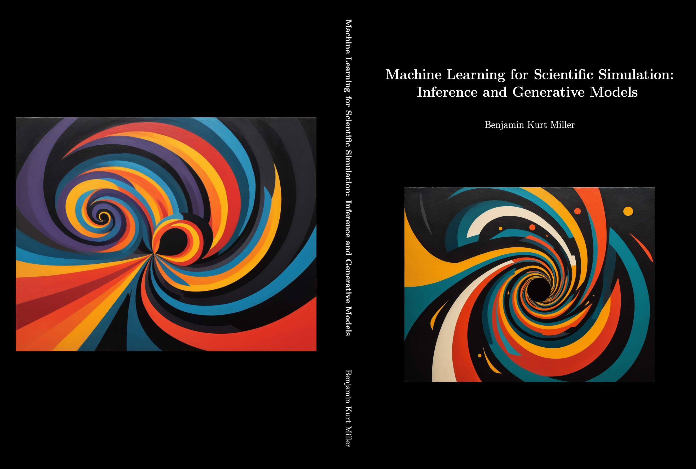

 

Benjamin Miller will defend his thesis *Machine learning for scientific simulation: Inference and generative models*. 
Promotors: Prof. Dr. M. Welling and Dr. C. Weniger; co-promotors and daily supervisors: Dr. P.D. Forré 
and Dr. S.M. Nissanke.



#### PhD thesis summary

This thesis presents methods for learning statistical models of data from scientific simulators. Due to their complexity, scientific simulators can be costly to design and run. Furthermore, doing the inverse problem, i.e. determining which inputs to provide to the simulator in order to output a simulated observation that “matches” something observed in the lab, is typically intractable. We develop generative models that enable us to create more synthetic data or to solve the inverse problem using these simulators.

