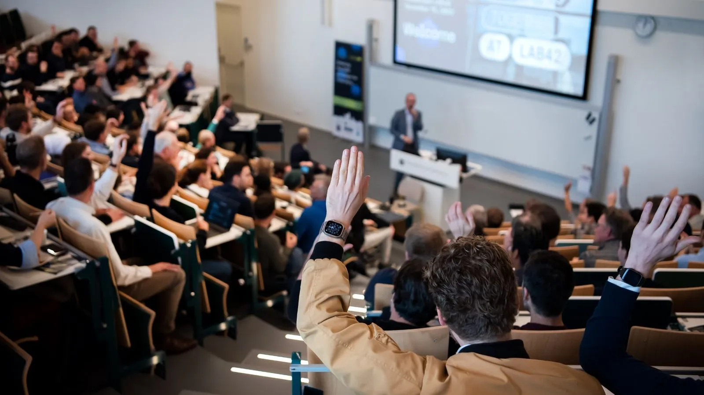

Together with the Amsterdam Chemistry Network and TI-COAST, we are organizing the second ChemAI Symposium on November 29th in the Lab42 building at Science Park Amsterdam. Please join us! We are looking forward to connect with academic and industrial partners to enlarge our consortium. Click on the button below to see the program and to register.



<a class="radius button small" href="https://www.acnetwork.nl/chemai">Learn More</a>

Get an impression of the event from the video and photo gallery of last years’ ChemAI 2023:

<a class="radius button small" href="https://www.acnetwork.nl/news/chemai-is-a-wrap">ChemAI 2023 Gallery</a>

