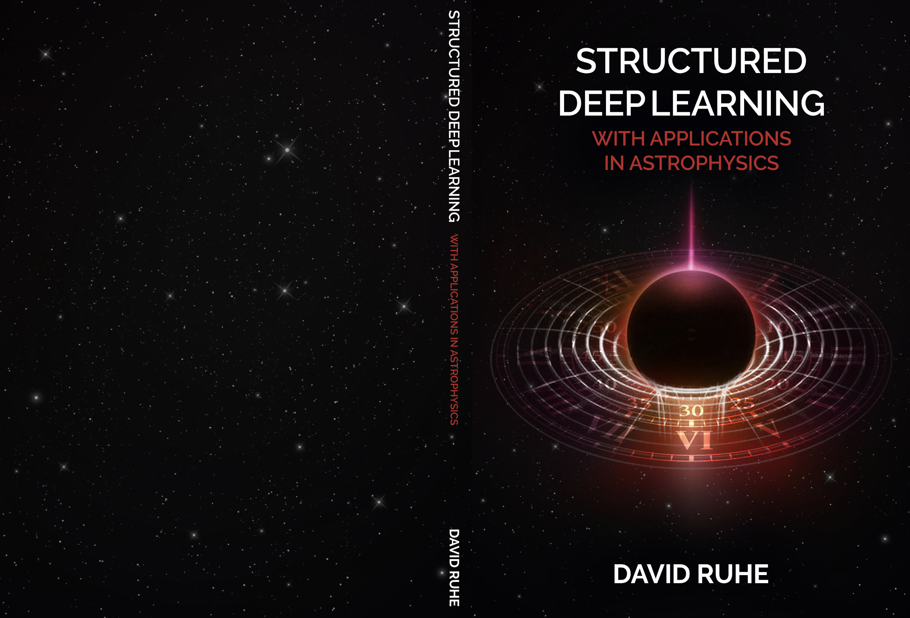

 

David Ruhe will defend his thesis *Structured Deep Learning with Applications in Astrophysics*.
Supervisors: Dr. P.D. Forré and Prof. dr. R.A.M.J. Wijers. Co-supervisors: Dr. B.A. Rowlinson and Prof. dr. M. Welling.



#### PhD thesis summary

In recent years, deep learning for scientific applications has gained signifi- cant attention with applications in a wide range of fields, including chemistry, biology, physics, and astronomy. This thesis explores the use of geometric, temporal, or other inductive biases for (scientific) deep learning. It is broadly divided into two parts: the first part focuses on structured deep learning, while the second part discusses certain applications in astrophysics. Each chapter tackles different challenges and research questions, which we outline below.

We start the structured deep learning part with a novel self-supervised algo- rithm for time-series particle filter models. The models resulting from this method can be applied to a wide range of fields where data is noisy and the underlying dynamics are unknown. Moreover, we can effectively incorpo- rate expert scientific knowledge and are able to perform exact inference while remaining efficient and expressive.

The second chapter introduces geometric algebra-based neural networks for modeling dynamical systems. By parameterizing linear transformations as compositions of symmetry group actions, the network is able to faithfully learn the transformation laws of the underlying dynamical system. This parameter- ization shows its strength in the context of rigid body dynamics as well as fluid mechanics simulations.

In chapter three, we propose Clifford Group-Equivariant Neural Net- works for learning frame-agnostic data representations. Due to the generality of the framework, these models can be applied to problems in various dimen- sions considering a variety of symmetry groups including the Lorentz group often used in relativistic (astro)physics.

The fourth chapter introduces Rolling Diffusion Models for learning gen- erative models of time-series data such as video or scientific simulations. Es- pecially when the temporal dynamics are complex, the model shows improved performance compared to existing methods.

In part two of the thesis, we first propose a deep learning-backed algorithm for hunting transient radio sources without any kind of supervised learning or human intervention. It constructs an end-to-end pipeline that con- sumes imaged radio interferometric data from LOFAR’s AARTFAAC system and produces a catalog of transient radio sources. Due to the low frequency regime, high noise levels, the high dimensionality and dispersed signals, it fills a methodological gap for this subfield, especially in light of the upcoming Square Kilometer Array (SKA) telescope.

Finally, we explore using normalizing flows to infer gravitational wave parameters from the noisy data of the LIGO and Virgo detectors. It is shown that the resulting posterior predictive distributions align well with ex- isting knowledge or simulated ground truth, paving the way for more efficient, accurate, and high-dimensional inference in the future.

