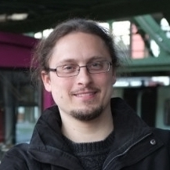

A lecture series on *machine learning in physics* is organised by [Dr. Christoph Weniger][1] focused on such topics as equivariant neural networks, simulation-based inference, and transformers. Each event is scheduled for 90 minutes, in which the first 60 minutes will feature local or national speakers introducing a topic, followed by short talks from MSc/PhD students or postdocs on related applications. The final 30 minutes will be an optional crash course on how to use the presented techniques in practice, using Google Colab notebooks.
 

*Time schedule of the lecture series:*

|---|---|---|
|---| When| Topic |
|---|---|---|
| 1 | Friday 23 May, 13:00 - 14:30  | Basics of deep learning (MLPs, SGD)  |
| 2 | Friday 3 June, 13:00 - 14:30  | Equivariant neural networks  |
| 3 | Friday 4th July, 1pm - 2:30pm  | Simulation-based inferece  |
| 4 |   TBA   | Transformers  |
| 5 |   TBA   |  Differentiable programming and optimisation |
|---|---|---|

[1]: https://www.uva.nl/en/profile/w/e/c.weniger/c.weniger.html
