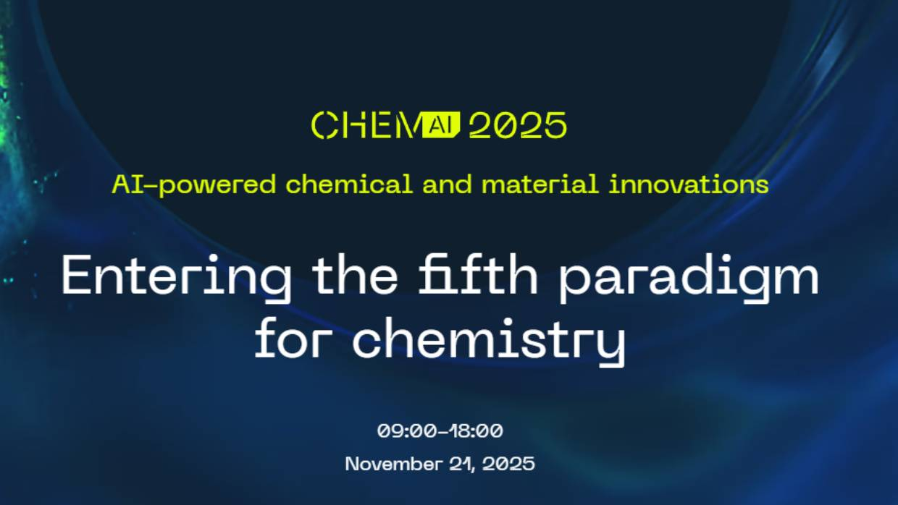

For the third time, we are organising together with [ACN][1], [COAST][2], and [AmsterdamAI][3] 
the annual [ChemAI Event][0]! The program is again packed with captivating presentations 
from world-leading experts, discussion and poster sessions, pitches at our fashionshow, 
and ample room for networking with our ca. 300 participants from academia and industry.

Keynotes from global leaders in AI and materials science include:
- Prof. Christopher Bishop (Microsoft Research) on the “fifth paradigm for science”
- Prof. Juan de Pablo (NYU) on materials and molecular modelling
- Prof. Cecilia Clementi (FU Berlin) on biomolecular dynamics and AI
- Dr. Ewa Gajewska (Merck) on retrosynthesis software
- Dr. Sam Cooper (Imperial College London) on AI for energy storage and materials



For further details on ChemAI and registration go to the ChemAI webpage:

<a class="radius button small" href="https://www.acnetwork.nl/chemai">ChemAI website</a>

[0]: https://www.acnetwork.nl/chemai
[1]: https://www.acnetwork.nl
[2]: https://www.ti-coast.com
[3]: https://www.amsterdamai.com/en/
