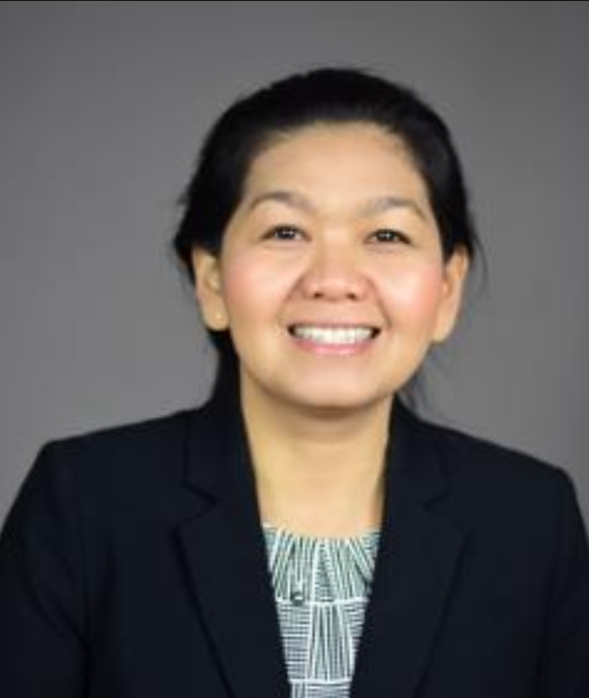

From Monday, November 17th until Friday, November 21st, the Amsterdam Chemistry Network (ACN), Amsterdam AI4Science, and TI-COAST, will host several exciting ChemAI satellite events, such as courses and webinars, on the topic of artificial intelligence and chemistry, culminating in the third ChemAI Symposium on the Friday afternoon.

Below is a schedule of the ChemAI Week. **To register** for any of these events go [this website][2].

In addition, the ChemAI week is followed by a Lorentz Center Workshop [*AI for Secure, Safe, and Sustainable Molecules and Materials (AI4S3M2)*][3] on 24 - 28 November 2025 in Leiden.

|---|---|
|ChemAI Weekday | What's happening |
|---|---|
| Monday, 17 November |   &#8226; 15:00 - 17:00 hr: *Elements of Artificial Intelligence – a Crash Course on Machine Learning for Chemists*  &#8192; hybrid meeting ([zoom link][42]) at Science Park Room A1.16 and online by [Bernd Ensing][6] and [Nong Artrith][10]  |
| Tuesday, 18 November | &#8226; 15:00 - 16:00 hr: *No Code, No Problem: Conversational Materials Science with ChatGPT*  &#8192;  webinar by Ass. Prof. Dr. Kamal Choudhary (NIST & Johns Hopkins University)|
| Wednesday, 19 November | &#8226; 15:00 - 17:00 hr: *AlphaFold Unfolded: How Protein Structure Prediction Actually Works*  &#8192; by Ass. Prof. Dr. Halima Mouhib (VU Amsterdam) and Dr. Gustavo Stolf Jeuken (VU Amsterdam) |
| Friday, 21 November | &#8226; 9:00 - 17:00 hr: *ChemAI Syposium*  (**SOLD OUT**)  &#8192; For full program and registration see [ChemAI website][1] |
| Monday,  24 November | &#8226; 15:00 CET: *Active Learning Symposium 2025*  &#8192; organized by Dr. Jakub Zeitler (Matterhorn Studio) Register at "[Active Learning Symposium 2025][43]" - Online |
|---|---|

### Abstracts

#### Lecture in Crash Course on Machine Learning for Chemists 
* Monday, 17 November, 15:00 - 17:00 hr
* Science Park Room A1.16 and online (([zoom link][42])

#### From Atoms to Accelerated Discovery: Machine Learning Pathways for Catalysis and Materials Innovation
by Dr. Nong Artrith   
*Debye Institute for Nanomaterials Science, Utrecht University, 3584 CG Utrecht, The Netherlands*

The search for efficient, earth-abundant catalysts and functional materials is central to achieving a
sustainable energy future. My research explores how machine learning (ML), integrated with atomistic
simulations, enables faster, deeper, and more scalable materials discovery.
Can ML answer the fundamental question: What makes a catalyst good? ML offers a shortcut through
complex chemical space by bypassing expensive first-principles calculations. From neural networks
that learn interatomic interactions to models that recognize patterns in catalytic activity, ML has become
an essential tool in computational chemistry.
However, ML needs data, and experimental datasets are often small and inconsistent. To address this,
we developed a hybrid approach that combines a machine-learned transition-state energy library with
simple regression models trained on experimental data. Applied to ethanol reforming, this method not
only explains observed trends but also proposes new, testable bimetallic catalysts.
Scaling this strategy requires efficient ML infrastructure. Our ænet-PyTorch platform enables GPU-
accelerated training of neural network potentials, significantly reducing computational cost. Because
data efficiency remains critical, we apply transfer learning from large open databases such as OC20 to
improve model generalization, enabling accurate simulations even with limited system-specific data.
For interfacial reactions such as the oxygen evolution reaction (OER), we use ML-trained potentials to
perform long-timescale metadynamics on Ni-doped BaTiO₃, revealing mechanistic insights beyond the
reach of standard DFT.

REFERENCES  
1. N. Artrith, Matter, 2020, 3 (4), 985.
2. N. Artrith, et al, Nature Chemistry, 2021, 13 (6), 505.
3. N. Artrith, et al, ACS Catalysis, 2020, 10 (16), 9438.
4. J. Lopez-Zorrilla, N. Artrith, et al. J. Chem. Phys. 2023, 158 (16), 164105.
5. A.N.E. Aisnada, K. Boonpalit, N. Artrith, et al, J. Phys. Chem. C, 2025, 129 (1), 658.
6. K. Boonpalit and N. Artrith (2025): https://doi.org/10.48550/arXiv.2412.15452

BIOGRAPHY  
Nong Artrith is a tenured Assistant Professor in the Materials Chemistry and
Catalysis Group at the Debye Institute for Nanomaterials Science, Utrecht
University, (and was a Visiting Researcher at Microsoft Research
Amsterdam Lab in 2022-2023). Prior to joining Utrecht University, Nong
was a Research Scientist at Columbia University, USA, and a PI in the
Columbia Center for Computational Electrochemistry. Nong obtained her
PhD in Theoretical Chemistry from Ruhr University Bochum, Germany, for
the development of machine-learning (ML) models for materials chemistry.
She was awarded a Schlumberger Foundation fellowship for postdoctoral
research at MIT and subsequently joined UC Berkeley as an associate
specialist. In 2019, Nong has been named a Scialog Fellow for Advanced
Energy Storage. Since 2023, Nong is a member of the NL ARC CBBC
(https://arc-cbbc.nl ). She is the main developer of the open-source ML
package ænet (http://ann.atomistic.net ) for atomistic simulations. Her
research interests focus on the development and application of first principles
and ML methods for the computational discovery of energy materials and for
the interpretation of experimental observations.

[1]: https://www.acnetwork.nl/chemai
[2]: https://www.eventbrite.nl/e/chemai-25-satellite-events-tickets-1343878539889?aff=ebdsoporgprofile
[3]: https://www.lorentzcenter.nl/ai-for-secure-safe-and-sustainable-molecules-and-materials-ai4s3m2.html
[6]: https://www.compchem.nl/staff_members/dr-ir-b-bernd-ensing/
[10]: https://www.uu.nl/staff/NArtrith
[42]: https://uva-live.zoom.us/j/62945043151
[43]: https://active-learning.uk/
