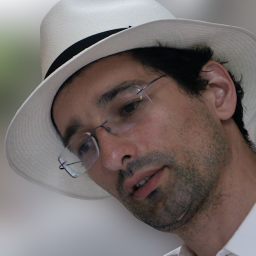

 

We are very happy to invite you to an AI4Science and John van Geuns Seminar by Prof Gábor Csányi from Cambridge University entitled
"*Foundational models for materials chemistry*".



#### Abstract

A new computational task has been defined and solved over the past 15 years for extended material systems: the analytic fitting of the Born-Oppenheimer potential energy surface as a function of nuclear coordinates. The resulting potentials (“force fields”) are reactive, many-body, with evaluation costs that are currently on the order of 0.1-10 ms/atom/cpu core (or about 1-10ms on a powerful GPU), and reach accuracies of a few meV/atom when trained specifically for a given system using iterative or active learning methods. The latest and most successful architectures leverage many-body symmetric descriptions of local geometry and equivariant message passing networks. Perhaps the most surprising recent result is the stability of models trained on very diverse training sets across the whole periodic table. Our recent discovery is that the MACE-MP-0 model that was trained on just ~150,000 real and hypothetical small inorganic crystals (90% of training set < 70 atoms), is capable of stable molecular dynamics at ambient conditions on any system tested so far - this includes crystals, liquids, surfaces, clusters, molecules, and combinations of all of these. The astounding generalisation performance of such foundation models open the possibility to creating a universally applicable interatomic potential with useful accuracy for materials (especially when fine-tuned with a little bit of domain-specific data), and democratise quantum-accurate large scale molecular simulations by lowering the barrier to entry into the field. Similarly, in the domain of organic chemistry, training just on small molecules and small clusters allows accurate simulation of condensed phase systems, and first principles prediction of quantities such as hydration free energies for the first time.

#### Bio

Gábor Csányi is a Hungarian-born scientist at the University of Cambridge. He read mathematics in Cambridge as an undergraduate at St. John’s College and did his PhD work in physics at MIT. After postdoctoral research in the Cavendish Laboratory, he joined the faculty in the Department of Engineering at Cambridge. He won an F. W. Bessel award from the Alexander von Humboldt foundation.

His work is in the field of computational chemistry, and is focused on developing algorithms to predict the properties of materials and molecules from first principles. He pioneered the application of machine learning to molecular modeling which lead to enormous gains in the efficiency of molecular dynamics simulation. 

