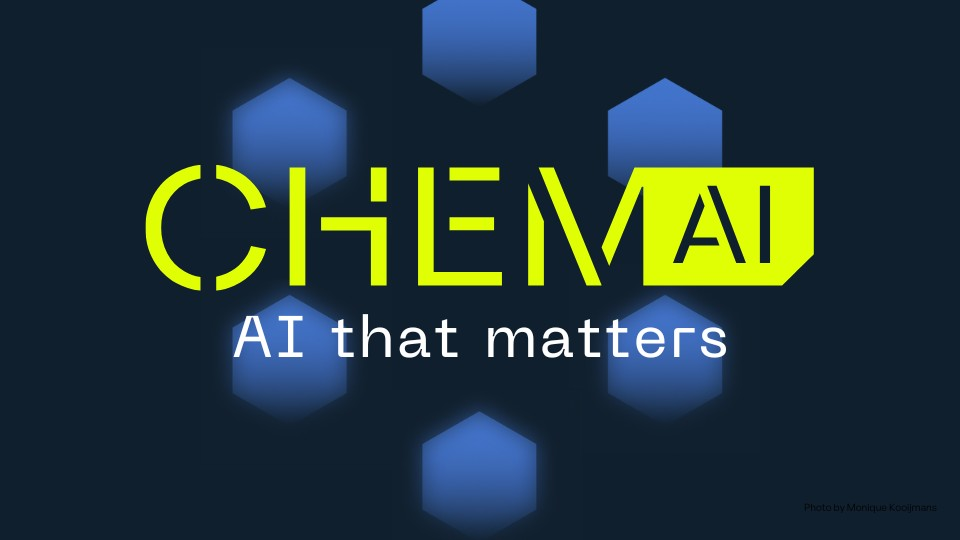
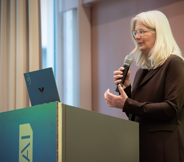

 

The third edition of ChemAI was opened by Susan te Pas, dean of the
UvA Faculty of Science, by welcoming around 350 attendees, including
academics, researchers, and industry leaders, highlighting the
transformative role of artificial intelligence in chemistry and
materials science.  The event offered attendees an unparalleled
opportunity to explore groundbreaking research, connect with
world-class talent, and engage with experts driving the future of AI
applications in chemistry.
Look back at this [ACN website][3] and see the program, a photo
impression, and more...

<a class="radius button small" href="https://www.acnetwork.nl/news/chemai-2025-where-ai-robotics-and-quantum-meet-molecules-and-materials">Read More›</a>

[3]: https://www.acnetwork.nl/news/chemai-2025-where-ai-robotics-and-quantum-meet-molecules-and-materials
