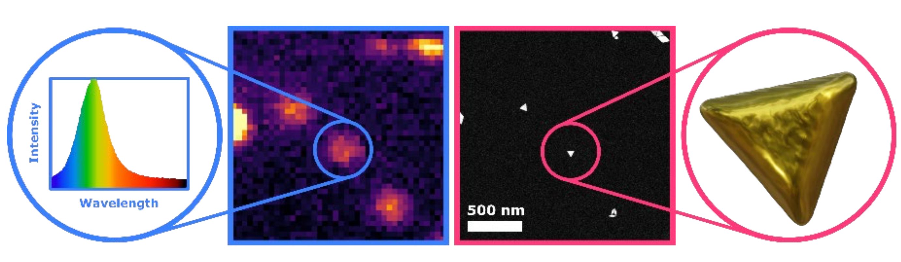

Plasmonic metal nanoparticles are used in a variety of applications ranging from biomedical to single molecule sensing and catalytic processes owing to their unique optical and catalytic properties. These properties are completely defined by their morphology. This intricate link leads to possibly unwanted changes in properties upon changes in morphology of the nanoparticles. However, the nanoparticle shape is often not stable under application environments such as high temperatures needed for catalytic reactions. Ideally, one would like to track the morphology in operando by using light excitation. One of the main barriers hereby is the diffraction limit, the fundamental limit restricting the ability to resolve details smaller than half the wavelength of light you are using for observation. We have built an optical set up that can image single nanoparticles down to this fundamental boundary and have further shown details on the order of a few nanometer can be extracted by making use of the underlying physics of plasmonics and through the application of Machine Learning techniques. The goal of this project is to work alongside CWI to implement more advanced Deep Learning Techniques, such as Graph Neural Networks, to expand the information being extracted and resolve details orders of magnitude smaller than the wavelength of visible light.

This Master project will be hosted by AMOLF and CWI, which are part of the Institutes Organisation of the Dutch Research Council (NWO) and are both located at Science Park Amsterdam. AMOLF performs leading research on the fundamental physics and design foundations of natural and man-made complex mater, with research in 3 interconnected themes: sustainable energy materials, information in mater, and autonomous mater. AMOLF leverages these insights to create novel functional materials, and to find solutions to societal challenges in renewable energy, green ICT, and health care. It has approximately 130 scientists and a total size of ca. 200 employees. At AMOLF, you will work at the Hybrid Nanosystems group. We combine single-particle optical and advanced electron microscopy to answer fundamental questions about the complex interaction between different classes of nanomaterials. We also explore new architectures for creating functional and smart hybrid nanosystems.

Centrum Wiskunde & Informatica (CWI) is the Dutch national research institute for mathematics and computer science. The mission of CWI is to conduct pioneering research in mathematics and computer science, generating new knowledge in these fields and conveying it to trade, industry, and society at large. CWI is an internationally oriented institute, with 160 scientists from approximately 27 countries, an informal atmosphere and short lines of communication. Your host at CWI will be the Computational Imaging group. The group is developing the next generation of 3D imaging – enabling scientists to look further into objects of all kinds. Based on mathematics, algorithms and numerical solution techniques, the approach is interdisciplinary, combining aspects of mathematics, computer science and physics.

