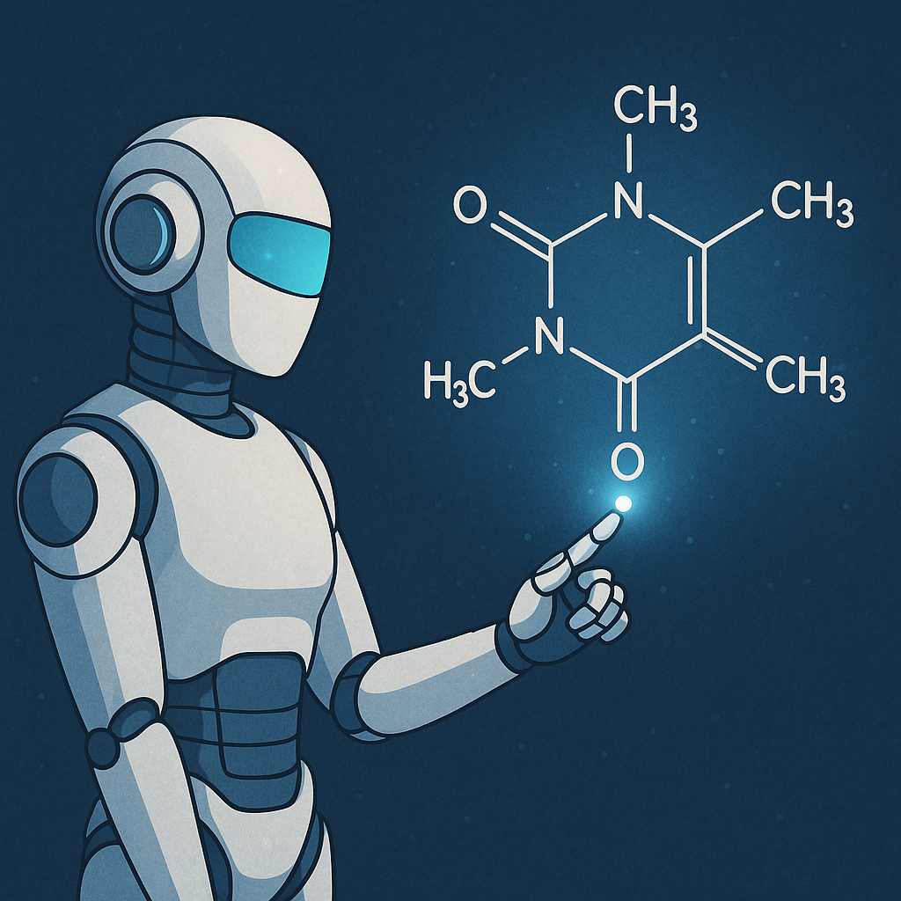

Synthesizing molecules and doing experimental analyses can take weeks or even months of labor-intensive research. Generative AI offers a unique opportunity to speed up this process. By efficiently proposing candidate molecules, Generative AI could help experimentalists narrow down the chemical search space significantly---saving countless work-hours. 

In the current state of the art, most approaches use either a Diffusion/Flow-based model on a graph-based representation or frameworks based on LLMs, for a token-based representation of molecules (SMILES). These approaches are demonstrably effective, but are very dissimilar from the *chemical intuition* used by chemists in the same molecular design process. As such, these methods can seem like a black box, which hinders the furtherance of GenAI in this context.

The *AlphaMol* project seeks to address this issue by using a completely different approach to navigating the vast chemical space. Motivated by the success of AlphaZero & Monte Carlo Tree Search (MCTS) in Reinforcement Learning problems, you will design and develop a Reinforcement Learning agent, similar to AlphaZero, on a new domain: molecule generation. In the process, you will create your own algorithm for effectively navigating the chemical space, by autoregressively 'growing' a molecule from scratch. This method is more interpretable than the 'black box' methods and is much more similar to the thought process of a chemist when designing new molecules.

### Supervision:
* Daily supervision: Alec Noppe (HIMS)
* Examinor: Bernd Ensing (HIMS)

