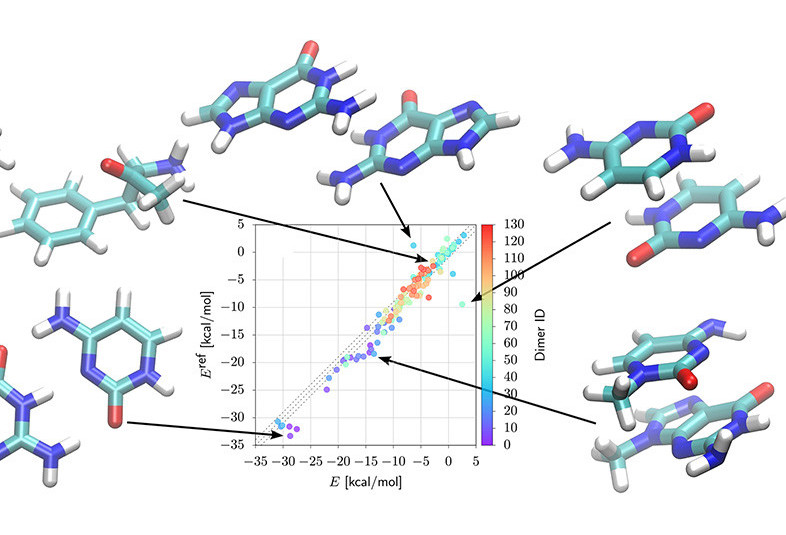

<!--more-->

Speaker: **Tristan Bereau**, Assistant professor, [Computational Soft Matter][1], HIMS, UvA

**Abstract:**  
Advanced statistical methods are rapidly impregnating many scientific fields, offering new perspectives on long-standing problems. In materials science, data-driven methods are already bearing fruit in various disciplines, such as hard condensed matter or inorganic chemistry, as well as soft matter to a smaller extent.
When coupling machine learning to molecular simulations, many problems of interest display dauntingly-large interpolation spaces, limiting their immediate application without undesired artifacts (e.g., extrapolation). The incorporation of physical information, such as conserved quantities, symmetries, and constraints, can play a decisive role in reducing the interpolation space. Conversely, physics can help determine whether a machine-learning prediction should be trusted, acting as a more robust alternative to the predictive variance.
In this talk I will show how incorporating physics in machine-learning models can help connect resolutions in multiscale modeling. Illustrations will include force-field parametrization, automated dimensionality reduction and clustering, and generative models to reintroduce atomistic detail in coarse-grained configurations.

Ref: <a href="https://www.cell.com/biophysj/fulltext/S0006-3495(20)30114-4">Biophysical Journal</a>

[1]: https://bereau.group/
[2]: /blog/
[9]: /laboratory/
