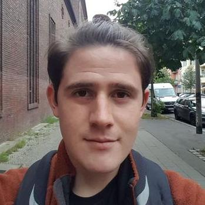
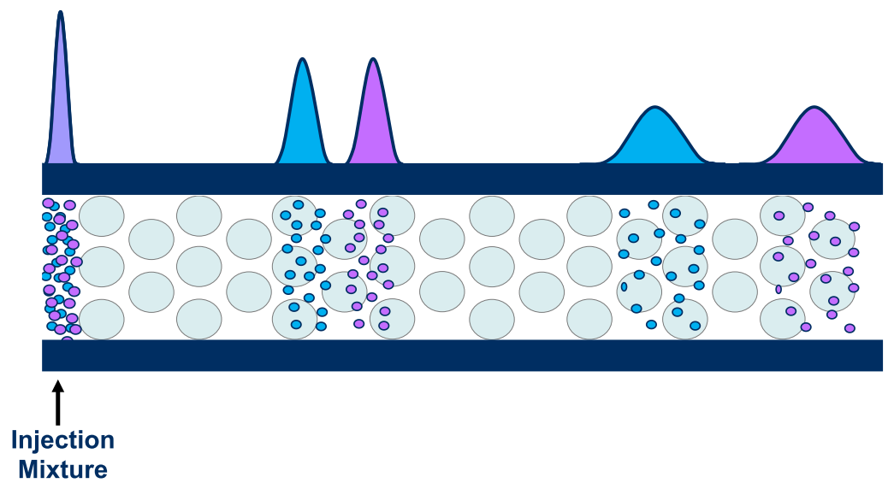
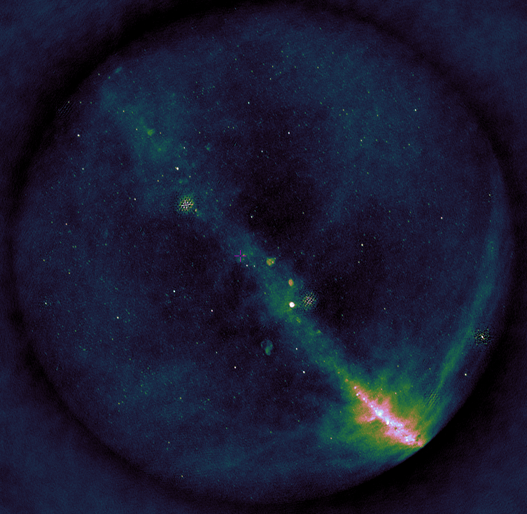
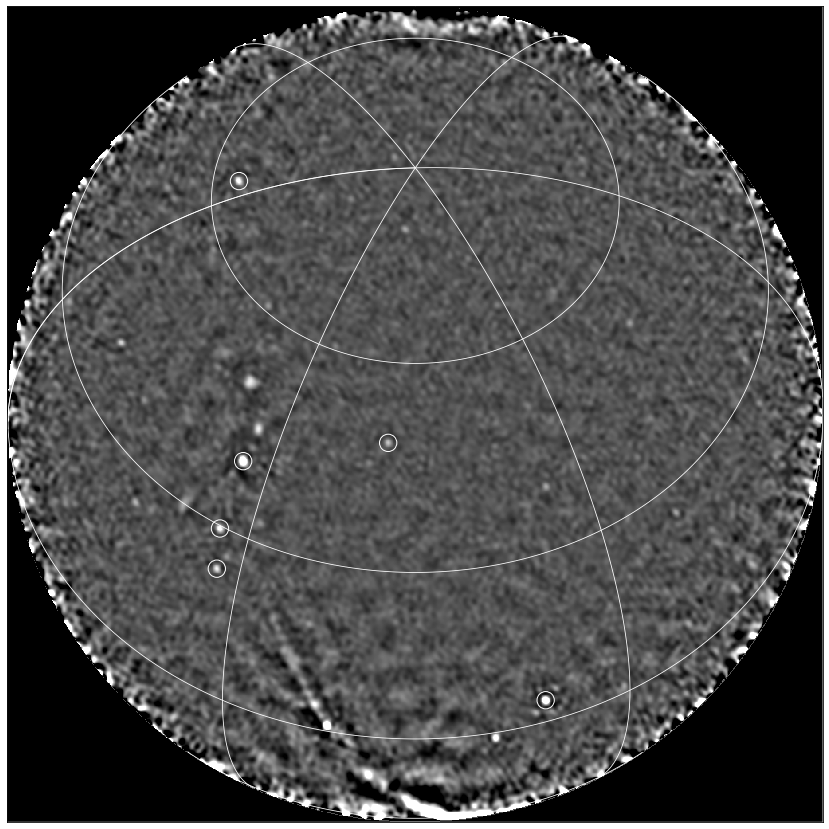

 <h1>Highlights</h1> 

## Gravitational Waves
 

The breakthrough discovery of the first gravitational wave signal in September 2015 (Nobel Prize 2017) has opened a new window to the Universe. Analyses of the signal waveforms during the initial inspiral, merger and final ringdown phase provide crucial information about the properties of superheavy stellar objects.

 By Benjamin Miller 

  

----------------------------------------------

## Liquid Chromatography
 

Two-dimensional liquid chromatography (2DLC) is a powerful technique to separate and detect trace molecular compounds in complex samples (think of proteins, antibodies, oils, paints, etc.). The separation is based on the difference in "retention" time that it takes for each compound to be carried by a solvent (mobile phase) through a column filled with a material (stationary phase) that interacts with the injected compounds based on a chosen property, such as molecular size, charge or hydrophilicity, as schematically drawn on the right. 2DLC is combined with a detection method such as UV-VIS, IR, or mass spectroscopy (MS), that identifies the separated molecules. As the compounds can have extremely low concentrations (e.g. protein biomarkers, plant hormones, food contaminants), the signals of interest are often buried in the noise of the data and information is being lost. Typical datasets contain several gigabytes of data per measurement.

Analyzing and extracting all relevant information from such data is a challenging task. In addition, 2DLC method development is daunting as there are numerous parameters one can vary in order to achieve optimal separation. Successful implementation of the technique requires months of costly and cumbersome development. In response to this, algorithms are being developed to model chromatographic interaction of analyte molecules with the chemical moieties of the stationary phase, so as to allow prediction of optimal chromatographic conditions. In this project, we will look at the application of AI techniques, such as Bayesian inference, Bayesian optimization and deep learning to tackle parameter optimization, peak detection, baseline correction, and more.

 By Jim Boelrijk

  

--------------------------------------------

## Radio Astronomy
 

One of the cutting edge areas of astronomy is recognising rare features in data streams in near-real time. This problem has arisen from massive imaging surveys of the sky at many wavelengths (optical, radio, X-ray). The purpose is no longer just to find objects that are there all or most of the time, but to find so-called ‘transient’ objects that appear fleetingly in hindsight.

These transients are typically multi-messenger events, meaning that their emission is seen throughout the electromagnetic spectrum and using other ‘messengers’ including neutrinos and gravitational waves. By combining the multi-messenger observations, we can probe the most extreme physical environments in the universe. However, we are not monitoring the whole sky all the time with sensitive observatories, so we need to alert them to interesting objects in order to trigger follow-up observations. As these events are often fleeting at different wavelengths, we need to trigger the follow-up in as close to real-time as possible.

Due to the nature of our searches, we cannot always predict the transient behaviour we are searching for, nor all more rare specific instrumental faults in the data stream. The real-time data streams are subject to different types of behaviour, which we do not want to confuse with astrophysical transient events, including radio frequency interference, calibration artefacts, varying noise features, space weather, meteors, airplanes and satellites.

There are multiple areas where ML can assist with solving the task at hand and the challenges it comes with. Examples are: finding latent (disentangled) representations of observed phenomena, undoing data corruption (e.g. denoising), unsupervised outlier detection, geometric deep learning. The project will explore the application and innovation of these techniques and will push the boundaries of machine learning and astronomy.

 By David Ruhe  

--------------------------------------------

