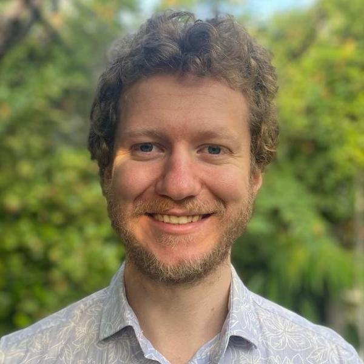

Researchers discover, study, and design molecules and
materials in all FNWI institutes related to chemistry, ecology, physics, 
and biology. The research focus area _Artificial Intelligence for Sustainable Molecules and Materials_
(AI4SMM) connects and promotes research focused on making molecules and 
materials for a sustainable planet by leveraging the utility of artificial intelligence.

The multidisciplinary AI4SMM Laboratory bridges the FNWI strengths related to
sustainability, AI, and design of smart materials and molecules. AI4SMM aims to
be a knowledge hub within a green and smart ecosystem that includes the UvA Sustainability
Platform, the AI4Science Lab, AMLab, the Data Science Center, the Computational Soft Matter Lab, 
the Computational Chemistry Group, but also the  MaterialenNL Platform, Port of Amsterdam, 
Microsoft Research, and so forth.

Read more about our mission and our aims for scientific research, 
education, and connecting with academic and industrial partners on our "About AI4SMM" page.

 <a class="radius button small" style="margin: auto;"
href="../ai4smm_rpa/">About AI4SMM></a> 

[comment]: Welcome, who are we? Link to our mission
[comment]: New post-docs starting
[comment]: ChemAI Event
[comment]: Bachelor and Master projects. Are you a UvA/VU bachelor or
[comment]: master student interested in developing and/or applying AI for
[comment]: sustainability? Please have a look at our projects page or send an
[comment]: email to ... 

---

 <h1>Invitation for flagship project proposals</h1> 

Previously, the FNWI Research Focus Area “Artificial Intelligence for Sustainable Molecules and Materials” (AI4SMM) has granted four kick-off projects that started in the past year as collaborations within different institutes within FNWI. The AI4SMM board has allocated the remaining budget of k€ 1,190 for a single flagship project, to start early 2025.

 <a class="radius button small" style="margin: auto;"
href="../ai4smm_call2/">Learn more></a> 

---

 <h2>A warm welcome to four AI4SMM postdoctoral fellows</h2> 

 <h1>AI4SMM Research</h1> 

Early 2023, the AI4SMM call for research proposals for postdoctoral fellowship projects 
was concluded and four excellent multidisciplinary projects were awarded. 
We are very happy that we can now welcome our first AI4SMM postdoctoral fellows to the lab:

  
  
Maxim Brodmerkel

  
  
Marco Federici

  
  
Alexander Korotkevich

  
  
Daniel  Acuña Ramirez

Maxim will be working on machine learning-based models of plant protein mixtures for sustainable 
food design. Marco's project is on chemical additives for
safe-and-sustainable-by-design plastics.
Alexander studies salt hydrates for thermal energy storage. And Daniel
developes metamaterials designed by AI for Sustainable Steel.

Click below to read further about their research plans. 

 <a class="radius button small center" href="../ai4smm_projects">Research Projects></a> 

---

