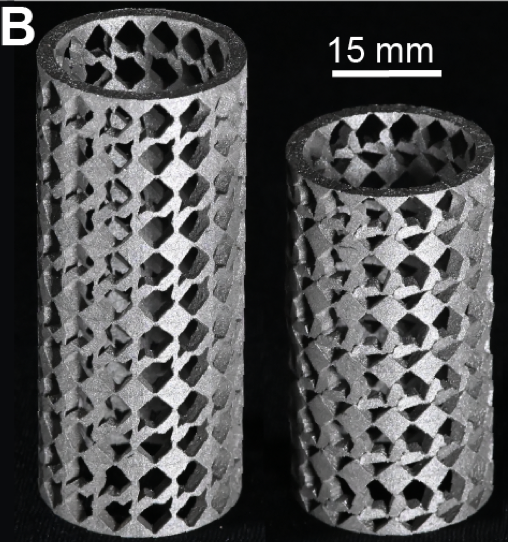
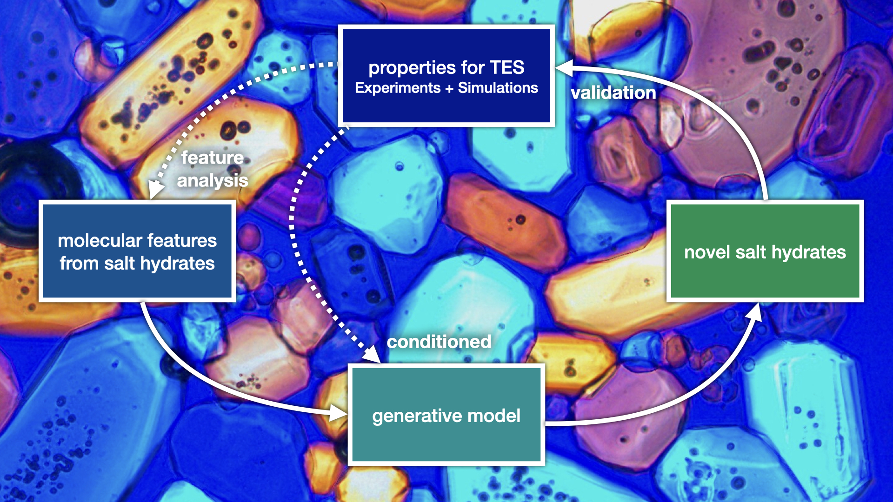

* This will become a table of contents (this text will be scrapped).
{:toc} 

* [Bachelor and Master student research projects](../ai4smm_students/)

---

###	Metamaterials designed by AI for Sustainable Steel

Designing sustainable yet high-performance mechanical systems is extremely difficult because
there are often conflicting requirements. For example, making a lighter energy damper is hard because the
energy absorbed by a material increases with its mass. An emerging opportunity is to use mechanical metamaterials to design components that meet specific criteria, such as yield strength and energy absorption, whilst minimizing the CO2 budget. We develop deep learning methods to accelerate the computational design of dissipative metamaterials that in turn enable new technology for sustainable steel.

##### Principal investigators:
{:.no_toc}
 * Corentin Coulais (IoP)
 *  Jan-Willem van de Meent (IvI)

---

### Salt hydrates for thermal energy storage  

  
  

    <i>Our approach combines experiments and simulations to identify key molecular features, proposes novel promising salt hydrates for thermal energy storage, and validates their properties.</i>
  

To accelerate the energy transition towards sustainable sources, there is an urgency to develop novel technologies. Thermal Energy Storage (TES) materials are a technology that can contribute to a secure energy supply. We investigate salt hydrates for which the reversible dehydration/hydration reactions can store/release heat. These have very high energy densities and are therefore promising candidates to reduce energy costs and peak power demand. We aim to increase efficiency, utilization, and lifetimes as well as to reduce capital costs. Delivering tunable and durable salt hydrates for TES could enable their widespread use in industry and society.

##### Principal investigators:
{:.no_toc}
* Alexander Korotkevich (AI4SMM)
* Noushine Shahidzadeh (IoP)
* Alberto Pérez de Alba Ortíz (HIMS & IvI)
* Sander Woutersen (HIMS)

---

###	Deep representation & simplification of chemical additives for safe-and-sustainable-by-design plastics

A data-driven approach can help to simplify the suite of chemical additives used in plastics to support the development of Safe-and-Sustainable-by-Design (SSbD) polymeric materials. Currently, most plastics are neither circular nor sustainable, in large parts due to the wide range of different chemical additives—which impart specific functions on plastic materials—posing safety concerns and limiting effective recycling strategies. We develop Graph Neural Network (GNN) models to categorize chemical additives into SSbD categories, based on their 3D molecular structure. The resulting short-list of safe chemical additives covering key functions is much needed for a transition towards the production of more sustainable plastics. 

##### Principal investigators:
{:.no_toc}
* Marco Federici
* Saer Samanipour (HIMS)
* Antonia Praetorius (SILS)
* Patrick Forré (IvI)

---

###	Machine Learning-based models of plant protein mixtures for sustainable food design

We use machine learning to predict structure, aggregation and rheological behavior of naturally occurring complex protein mixtures in plants to design sustainable and healthy plant-based food products. Focusing on emerging plant proteins, such as RuBisCo, pea, and potato proteins that can serve as sustainable substitutes for animal proteins, we develop a transferable colloidal model to predict aggregation, gelation and structural properties of complex mixtures and employ experimental data to train and validate the model. By leveraging this AI-driven model, we can accelerate a design pipeline for sustainable, plant waste-based, protein mixtures for food production.

##### Principal investigators:
{:.no_toc}
* Maxim Brodmerkel (AI4SMM)
* Peter Bolhuis (HIMS)
* Herke van Hoof (IvI)
* Sara Jabbari-Farouji (IoP)
* Francesca Quattrocchio (SILS)
* Peter Schall (IoP)
* Alberto Pérez de Alba Ortíz (HIMS & IvI)

---
