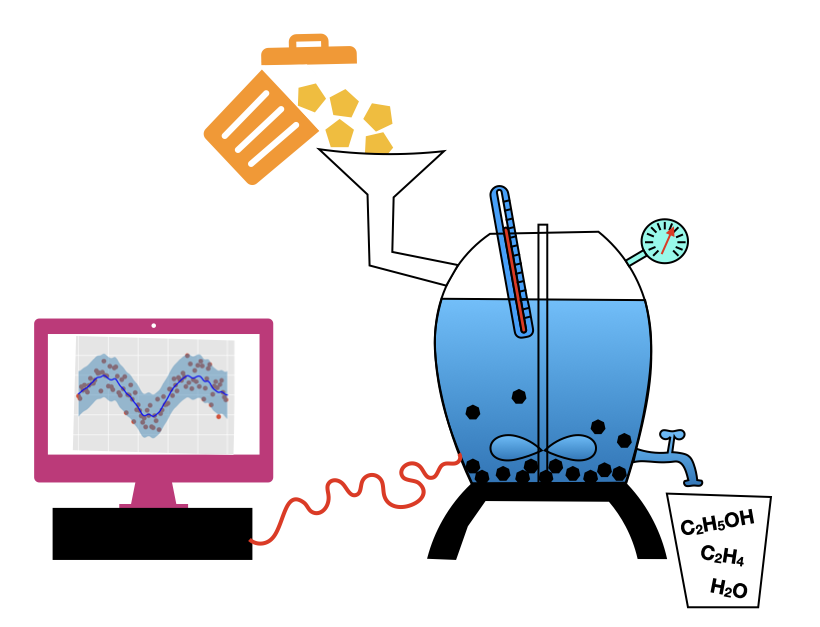
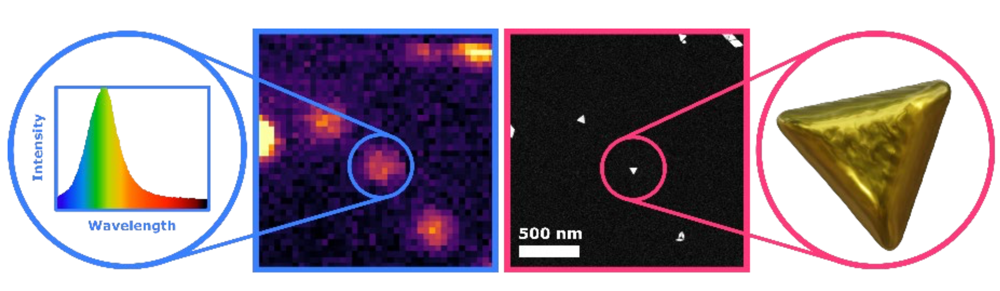

---

### Research projects for Bachelor and Master students
{:.no_toc}

Below follows a listing of available research projects for Bachelor or Master students
with an interest in AI for Sustainable Molecules and Materials, and with
a background in a relevant discipline, such as AI, Computational Science, Physics, Chemistry,
Biology, Astrophysics, etc. UvA and VU students interested in such a project are 
invited to contact one of the supervising faculty. Experience with machine learning and 
programming is recommended.  

Supervisors and group leaders with a student project relevant for the mission of AI4SMM 
can have their project description posted here by sending an email request to Bernd Ensing.

----------------------------------------------
* This will become a table of contents (this text will be scrapped).
{:toc}
----------------------------------------------

#### Master project 1
{:.no_toc}
## AI-guided catalytic conversion of plastic waste into sustainable molecules

Plastics are ubiquitous in every part of our society. However, only 9%
of used plastics are recycled, which creates an unsustainable
rest-stream of plastic waste, which is currently incinerated or
landfilled. The Catalysis Engineering group at HIMS is developing a
chemical hydrothermal liquefaction process that can transform complex
waste streams into useful resources, such as chemicals, materials,
nutrients and energy. However, a difficulty is the lack of predictability of
the reaction output in terms of yield, composition and by-product
formation because of the complex reaction network and the many input
parameters involved, including waste composition, reactor temperature,
pressure, and catalyst materials present.

In this master project, you will develop a novel AI-based strategy
aimed at modeling and guiding the hydrothermal liquefaction
process. First, using a diverse set of initial experimental data, you
will construct a machine learning-based simulator. Then,
introducing an AI-guiding framework based on active learning and
Bayesian optimization cycles, you will use and improve the simulator to
guide future experiments.

##### Supervision:
{:.no_toc}
 * Christian Naesseth (IvI)
 * Shiju. N. Raveendran (HIMS)
 * Bernd Ensing (HIMS)
 
----------------------------------------------

#### Master project 2
{:.no_toc}
## Develop and optimize Machine Learning Techniques to resolve nanoscale features below the diffraction limit

Plasmonic metal nanoparticles are used in a variety of applications
ranging from biomedical to single molecule sensing and catalytic
processes owing to their unique optical and catalytic properties. These
properties are completely defined by their morphology. This intricate
link leads to possibly unwanted changes in properties upon changes in
morphology of the nanoparticles. However, the nanoparticle shape is often
not stable under application environments such as high temperatures
needed for catalytic reactions. Ideally, one would like to track the
morphology in operando by using light excitation. One of the main
barriers hereby is the diffraction limit, the fundamental limit
restricting the ability to resolve details smaller than half the
wavelength of light you are using for observation. We have built an
optical set up that can image single nanoparticles down to this
fundamental boundary and have further shown details on the order of a
few nanometer can be extracted by making use of the underlying physics
of plasmonics and through the application of Machine Learning
techniques. The goal of this project is to work alongside CWI to
implement more advanced Deep Learning Techniques, such as Graph Neural
Networks, to expand the information being extracted and resolve details
orders of magnitude smaller than the wavelength of visible light.

This Master project will be hosted by AMOLF and CWI, which are part of
the Institutes Organisation of the Dutch Research Council (NWO) and are
both located at Science Park Amsterdam. AMOLF performs leading
research on the fundamental physics and design foundations of natural
and man-made complex mater, with research in 3 interconnected themes:
sustainable energy materials, information in mater, and autonomous
mater. AMOLF leverages these insights to create novel functional
materials, and to find solutions to societal challenges in renewable
energy, green ICT, and health care. It has approximately 130 scientists
and a total size of ca. 200 employees. At AMOLF, you will work at the
Hybrid Nanosystems group. We combine single-particle optical and
advanced electron microscopy to answer fundamental questions about the
complex interaction between different classes of nanomaterials. We also
explore new architectures for creating functional and smart hybrid
nanosystems.

Centrum Wiskunde & Informatica (CWI) is the Dutch national research
institute for mathematics and computer science. The mission of CWI is to
conduct pioneering research in mathematics and computer science,
generating new knowledge in these fields and conveying it to trade,
industry, and society at large. CWI is an internationally oriented
institute, with 160 scientists from approximately 27 countries, an
informal atmosphere and short lines of communication. Your host at CWI
will be the Computational Imaging group. The group is developing the
next generation of 3D imaging – enabling scientists to look further into
objects of all kinds. Based on mathematics, algorithms and numerical
solution techniques, the approach is interdisciplinary, combining
aspects of mathematics, computer science and physics.

##### Further information:
 * Dr. Wiebke Albrecht: w.albrecht@amolf.nl

----------------------------------------------

