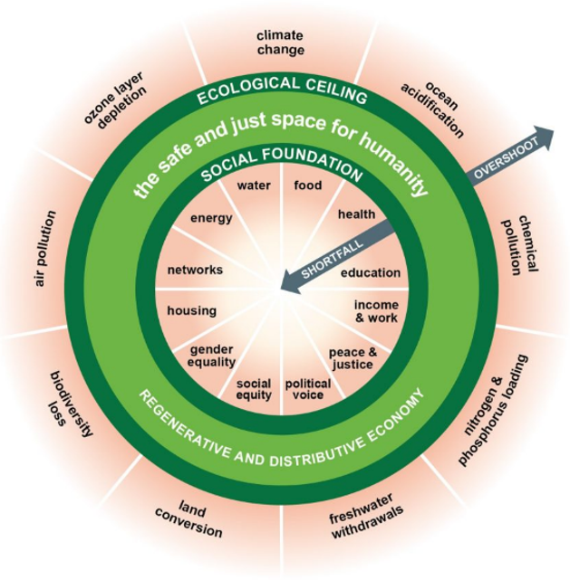

[Amsterdam Science Park][1] is an European hub for digital innovation and sustainability. The Faculty of Science (FNWI) in particular is in a unique position to link these two key disciplines because we have one of the best computer science institutes in the world, with unique knowledge of AI, Machine Learning, etc. Many major changes for the next decade will come from this. At the same time, the big challenges of the next decade are in the sustainability domain, such as the sustainability of all materials we produce, use and waste, see Kate Raworth’s figure of the Doughnut Economy below. The faculty also has a lot of knowledge and expertise in this area in its institutes, and so is uniquely positioned to combine the two. And that's what we're going to do.

More specifically: AI can be used as a tool in the prediction, design, analysis and testing (both by experiment and by modelling) for improved and novel molecules and materials that are safe and sustainable-by-design (SSbD) to reach a non-toxic environment. Examples are use of molecules and materials in food & agriculture, building materials, green industrial processes, energy transition, consumer materials, health, etc, etc. Disciplines involved are Physics, Chemistry, Biology, Ecology, Earth and Environmental Science, and of course Informatics. Emphasis is on the development of state- of-the-art AI/ML methods that can enable scientific discovery in the context of sustainable and safe molecules and materials, with a strong input from the mentioned disciplines, in the form or expertise on modeling, theory forming and experimentation.

<figure>
    
     <figcaption>Kate Raworth’s figure of the Doughnut Economy.</figcaption>
 </figure>
 

### How will the focus area forge new scientific connections and between which fields?

To strengthen FNWI’s focus on smart and green and create synergy between the [Zero Waste theme][2], [Duurzame MaterialenNL][3], the [AI4Science lab][4], [AMCEL][5], the [Computational Soft Matter lab][6], and [Microsoft Research][7], we initiate the RPA AI4SustainableM&M's that targets breakthroughs in sustainable innovation with AI and computational methods for molecules and materials to aid in realizing the materials transition needed for a sustainable society.

This RPA will bring together existing disciplinary strengths of [IvI][8], [IoP][9], [HIMS][10], [IBED][11] and [SILS][12] in an interdisciplinary program interfacing AI, computational molecular and materials science, with the development of sustainable technologies. Bridging sustainability with molecular and materials science will allow to predict quantitative structure-property relationships in the broadest sense: from functionality to degradability and interactions with the molecular or biological environment.

### The different components of the proposal

Capitalizing on these opportunities will require the development of “hybrid” models that combine deep learning with conventional simulation. The resulting models have the potential to dramatically accelerate discovery of sustainable technologies by identifying promising molecular and material compositions in a high-dimensional design space that cannot possibly be explored by way of physical experimentation alone or using existing simulation methods. This requires fundamental research on deep learning methods that leverage symmetries to facilitate generalization, “invert” simulations, learn fast surrogates for expensive numerical computations, and navigate the trade-off between exploration and exploitation in a high-dimensional design space. Depending on the desired resolution, the models describing the molecules and materials of interest can involve electronic structure calculations, atomistic force fields, or coarse-grained (or even lattice) descriptions, alerts for toxicity. For complex systems as ultimately the real environment in which the safe and sustainable molecules and materials are to be produced, used and reused, a multi-scale approach can be employed, requiring smart algorithms to bridge relevant temporal and spatial scales. As these approaches are often still computationally intensive, the combination with deep learning methodology will allow for a much more efficient exploration of the multidimensional parameter space.

### The central research question and how it is addressed

The goal of this RPA is to combine the deep learning methodological research with fundamental scientific experimental research on molecules and materials, where computational science is the “glue” that connects these two components. As such, we can contribute to alleviating sustainability challenges resulting from the current linear use of resources by (re-)designing processes, materials, molecules and products to keep resources and products in closed cycles where possible and focus on circular design, re-use, recovery and recycling, resource and energy efficiency, as well as nature- inspired solutions. This RPA presents an opportunity to develop proof-of-concept work for AI-driven computational approaches that can guide experimental efforts both on functionality as well as on environmental fate and impact of the materials and molecules. Our goal is to leverage the outcomes of this RPA as seed research to establish close connections between the UvA and industry partners, ideally in the form of one or more labs.

### How will the focus area have an effect on education?

AI is becoming increasingly important in all disciplines of science. It is therefore important to incorporate the growing role of AI, Machine Learning and other relevant informatics tools into all the disciplinary curricula. As a research-based university, this faculty must foster research into the role AI can play along the different disciplinary educational paths. However, the heart of the RPA is interdisciplinary research and education. Here we can anticipate strong interactions with the interdisciplinary education, notably Future Planet Studies and the new Science and Design BSc. Programs. Note that the Science and Design curriculum is focused on four interdisciplinary themes: 1) high-tech designer materials, 2) renewable energy and resources, 3) engineering life and health, and 4) information science, modelling and simulation, where this new RPA AI for Sustainable Molecules and Materials will greatly stimulate the interdisciplinary teaching for all four themes. The expectation is that dedicated interdisciplinary AI education will also be interesting for, e.g., the Amsterdam University College, so that synergies with AUC education will also be possible.

### Which types of societal impact does the focus area aim for?

RPA AI4SustainableM&M's research at FNWI will be interdisciplinary, system-aware, applicative, creative, and will have strong connections with leading industries and sectors, where we connect fundamental research embedded in a broad traditional university with innovations at higher TRLs. The sustainability issues we are tackling are pressing, we do not have much time to transition. Therefore, we focus on making research applicable and strive for co-creation with implementation partners and parallel trajectories of R&D and implementation to break with the traditional research-pilot-implementation sequence to accelerate the innovation process. We aim for close collaborations with industry, businesses, and the municipality of Amsterdam to i) inform our research priorities, ii) collect useful and interesting data-sets, iii) co-create and develop, iv) bring our solutions into application. We envision an open atmosphere of continuous learning, with strong ties with FNWI’s educational programs, and exchange of ideas to nurture the RPA theme and to develop fundamental knowledge that has the potential to lead to real world applications in the future that will contribute to a more sustainable world.

## Governance and organization:

### Which institute acts as secretary of the focus area?
The Van 't Hoff Institute for Molecular Sciences (HIMS) acts as secretary of the focus area.

### How does decision-making take place?
The core group of this RPA AI for Sustainable Molecules and Materials will function as the board, which is the decision making body that oversees the RPA-wide activities, and consists of:

* [Prof. dr. P.G. (Peter) Bolhuis][14], HIMS
* [Prof. dr. D. (Daniel) Bonn][15], IoP
* [Dr. B. (Bernd) Ensing][13] (Coordinator), HIMS, AI4Science Lab 
* [Prof. dr. M.A. (Michel) Haring][16], SILS
* [Dr. J.W. (Jan-Willem) van de Meent][17], IvI
* [Dr. J.C. (Chris) Slootweg][18], HIMS
* [Prof. dr. A.P. (Annemarie) van Wezel][19], IBED

### Contact

Get in contact with AI4Sustainability via:

[Marcel Bartels](https://www.uva.nl/profiel/b/a/m.j.bartels/m.j.bartels.html) 
*Instituutsmanager* HIMS 

Van 't Hoff Institute for Molecular Sciences 
University of Amsterdam 

[1]: https://www.amsterdamsciencepark.nl
[2]: https://www.uva.nl/en/about-the-uva/about-the-university/sustainability/sustainable-operations/sustainable-waste-separation/sustainable-waste-separation.html
[3]: https://www.topsectorenergie.nl/nieuws/duurzame-materialennl-maakt-nederland-koploper-van-de-materialentransitie
[4]: https://ai4science-amsterdam.github.io
[5]: https://www.amcel.nl
[6]: https://iop.fnwi.uva.nl/computational_soft_matter/
[7]: https://www.microsoft.com/en-us/research/lab/microsoft-research-amsterdam/
[8]: https://ivi.uva.nl
[9]: https://iop.uva.nl
[10]: https://hims.uva.nl
[11]: https://ibed.uva.nl
[12]: https://sils.uva.nl
[13]: https://www.uva.nl/en/profile/e/n/b.ensing/b.ensing.html
[14]: https://www.uva.nl/en/profile/b/o/p.g.bolhuis/p.g.bolhuis.html
[15]: https://www.uva.nl/en/profile/b/o/d.bonn/d.bonn.html
[16]: https://www.uva.nl/en/profile/h/a/m.a.haring/m.a.haring.html
[17]: https://www.uva.nl/en/profile/m/e/j.w.vandemeent/j.w.van-de-meent.html
[18]: https://www.uva.nl/en/profile/s/l/j.c.slootweg/j.c.slootweg.html
[19]: https://www.uva.nl/en/profile/w/e/a.p.vanwezel/a.p.van-wezel.html

