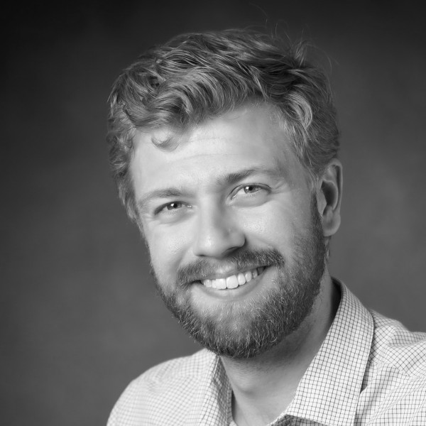

> Knowledge Shared = Knowledge2

The AI4Science Colloquium is a bi-weekly colloquium series, held on alternating Tuesdays at 14:00 Central European Time. In this colloquium our very own Teodora Pandeva and Fiona Lippert invite renowned speakers to present and discuss their state-of-the-art AI solutions for scientific discovery. Interested? Subscribe to our Email-list to be notified.

## Email List
To stay up to date with our activities and be invited to our biweekly AI4Science colloquium series, you may send a request to be included in our emaillist via [an email to us][9] with your name, affiliation and a one-sentence motivation for joining.

## Next Colloquium

#### Ultra-fast molecular simulators and data-driven protein design

Date: 18-01-2022 14:00-1500 Central European Winter time

 

Speaker: **Andrew Ferguson**, Pritzker School of Molecular Engineering, University of Chicago

**Abstract:**  

Data-driven modeling and deep learning present powerful tools that are opening up new paradigms and opportunities in the understanding, discovery, and design of soft and biological materials. In this talk, I will first describe an approach based on latent space simulators to learn ultra-fast surrogate models of protein folding by stacking three specialized deep learning networks to (i) encode a molecular system into a slow latent space, (ii) propagate dynamics in this latent space, and (iii) generatively decode a synthetic molecular trajectory. I will then describe our recent applications of deep representational learning to expose the sequence-function relationship within homologous protein families and to use these principles for the data-driven design and experimental testing of synthetic proteins with new and/or elevated function.

**Bio:** 

Andrew Ferguson is an Associate Professor and Deputy Dean for Equity, Diversity, and Inclusion at the Pritzker School of Molecular Engineering at the University of Chicago. He received an M.Eng. in Chemical Engineering from Imperial College London in 2005, and a Ph.D. in Chemical and Biological Engineering from Princeton University in 2010. From 2010 to 2012 he was a Postdoctoral Fellow of the Ragon Institute of MGH, MIT, and Harvard in the Department of Chemical Engineering at MIT. He commenced his independent career as an Assistant Professor of Materials Science and Engineering at the University of Illinois at Urbana-Champaign in August 2012 and was promoted to Associate Professor of Materials Science and Engineering and Chemical and Biomolecular Engineering in January 2018. He joined the Pritzker School of Molecular Engineering in July 2018. His research uses theory, simulation, and machine learning to understand and design self-assembling materials, macromolecular folding, and antiviral therapies. He is the recipient of a 2020 Dreyfus Foundation Award for Machine Learning in the Chemical Sciences and Engineering, 2018/19 Junior Moulton Medal of the Institution of Chemical Engineers, 2017 UIUC College of Engineering Dean's Award for Excellence in Research, 2016 AIChE CoMSEF Young Investigator Award for Modeling & Simulation, 2015 ACS OpenEye Outstanding Junior Faculty Award, 2014 NSF CAREER Award, 2014 ACS PRF Doctoral New Investigator, and was named the Institution of Chemical Engineers North America 2013 Young Chemical Engineer of the Year. He is the co-founder of the protein engineering company Evozyne, Inc. ([www.evozyne.com][8]).

## Schedule

- 18 January 2022 - **Andrew Ferguson**
- 1 February 2022 - **Jan-Matthis Lückmann**
- 15 February 2022 - **Anna Scaife**
- 15 March 2022 - **Rajesh Ranganath**
- 29 March 2022 - **Katie Bouman**
- 12 April 2022 - **Gabriel Vivó-Truyols**

## Previous Colloquium

#### Probabilistic Programming in Scientific Simulators

Date: 21-12-2021 14:00-1500 Central European Winter time

 

Speaker: **Atılım Güneş Baydin**

**Abstract:**  

Probabilistic programming languages (PPLs) allow us to specify complex generative models as computer code and perform Bayesian inference in these models automatically. However, applications of these languages in the science domain remain limited because of the impracticability of rewriting complex scientific simulators in a PPL, the computational cost of inference, and the lack of scalable implementations. To address these, we present a novel probabilistic programming framework that couples directly to existing scientific simulators through a cross-platform probabilistic execution protocol and provides Markov chain Monte Carlo (MCMC) and deep-learning-based inference compilation (IC) engines for tractable inference. The talk will cover the technical details of how a PPL system can be coupled to any given simulator so that these two sides can be (1) implemented in different programming languages and (2) executed in separate processes and possibly on separate machines across a network connection. We show examples of the approach in particle physics, epidemiology, and simulation of composite materials. We show how the simulator can be replaced with a fast deep-learning-based surrogate making use of the probabilistic execution protocol and retaining the original address structure of the simulator. We also talk about technical challenges of repurposing simulators as probabilistic programs, such as dealing with very large numbers of latent variables and nested stochastic subprocedures.

<!--
<a class="radius button small" href="https://drive.google.com/file/d/14wWf4SuFOYf3vFLJ814m563LdI01gxTl/view?usp=sharing">Watch Back ›</a>
-->

For an overview of more  previous colloquia, please have a look at out [blog][2].

[1]: https://bereau.group/
[2]: /blog/
[9]: /contact/
[3]:https://github.com/undark-lab/swyft
[4]:https://arxiv.org/abs/2011.13951
[5]:http://www.mathben.com/
[6]:https://pubs.acs.org/doi/10.1021/acs.jctc.0c00981
[7]:https://github.com/Ensing-Laboratory/FABULOUS
[8]:www.evozyne.com

