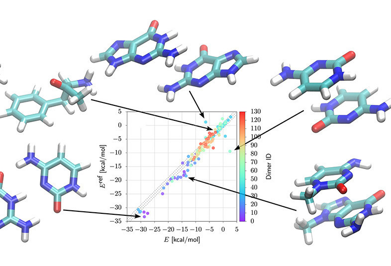

> Knowledge Shared = Knowledge2

The AI4Science Colloquium is a bi-weekly colloquium series, held on alternating Tuesdays at 14:00 Central European Time. In this colloquium our very own Teodora Pandeva and Fiona Lippert invite renowned speakers to present and discuss their state-of-the-art AI solutions for scientific discovery. Interested? Subscribe to our Email-list to be notified.

## Email List
To stay up to date with our activities and be invited to our biweekly AI4Science colloquium series, you may send a request to be included in our emaillist via [an email to us][9] with your name, affiliation and a one-sentence motivation for joining.

## Next Colloquium

#### Title: Precision analysis of gravitational strong lensing images with nested likelihood-free inference

Date: 29-09-2020 14:00-15:00 Central European Summer Time

 

Speaker: **Christoph Weniger**, Assistant Professor of Theoretical Physics, Institute of Physics, University of Amsterdam

**Abstract:**  
Optical images of galaxy-galaxy lensing systems carry information about the small scale structure of dark matter. Although the underlying physics is simple, the large uncertainties regarding the surface brightness of the source galaxy as well as the mass distribution in the lensing galaxy make these images notoriously difficult to model and to analyse. In order to tackle this difficult task, we developed a new analysis pipeline that makes use of a whole arsenal of modern machine learning techniques: variational inference, probabilistic programming, Gaussian processes, and neural likelihood-to-ratio estimation. I will present the current state of our work, discuss remaining challenges, as well as opportunities for similar astronomical image analysis problems.

<!--

Ref: <a href="https://aip.scitation.org/doi/10.1063/1.5009502">Journal of Chemical Physics</a>

-->

## Schedule
* 29 September 2020 - **Christoph Weniger**
* 13 October 2020 - **David Fisher**
* 27 October 2020 - **Gábor Csányi**

## Previous Colloquia

#### Title: Permutation-Equivariant neural networks for Molecular Generation

Date: 15-09-2020 14:00-15:00 Central European Summer Time

 

Speaker: **Erik Henning Thiede**, Research Fellow, Flatiron Institute, University of Chicago

**Abstract:**  
In the last five years, neural networks have emerged as a dominant paradigm for constructing generative models of images and sound data. However, challenges remain when building generative models for molecules. Since molecules are made of collections of indistinguishable particles, they are symmetric to permutation, a symmetry not respected by basic neural network architectures. While neural networks have been constructed that obey permutation symmetry using message-passing ideas, these architectures rely on knowing the molecular structure in advance, limiting their use for generative models.
Here, we introduce a new approach that constructs molecular graphs using permutation-equivariant layers formed by convolutions over the group of permutations. Using these layers, we are able to construct a variational autoencoder that preserves permutational symmetry from input to output. This allows for direct comparison of the inputs to the outputs, avoiding the requirement to solve a potentially costly graph matching problem. Our architecture is able to achieve results comparable to other competing architectures using considerably less domain knowledge.

<!--

Ref: <a href="https://aip.scitation.org/doi/10.1063/1.5009502">Journal of Chemical Physics</a>

-->

 
<a class="radius button small" href="https://drive.google.com/file/d/1XTjPvuGhMHCD0CmBWP8KPzNU4rDPyh_6/view?usp=sharing">Watch Back ›</a>

For an overview of more  previous colloquia, please have a look at out [blog][2].

[1]: https://bereau.group/
[2]: /blog/
[9]: /contact/
