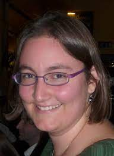

> Knowledge Shared = Knowledge2

The AI4Science Colloquium is a bi-weekly colloquium series, held on alternating Tuesdays at 14:00 Central European Time. In this colloquium our very own Teodora Pandeva and Fiona Lippert invite renowned speakers to present and discuss their state-of-the-art AI solutions for scientific discovery. Interested? Subscribe to our Email-list to be notified.

## Email List
To stay up to date with our activities and be invited to our biweekly AI4Science colloquium series, you may send a request to be included in our emaillist via [an email to us][9] with your name, affiliation and a one-sentence motivation for joining.

## Next Colloquium

#### Machine Learning in Supercooled Liquids

Date: 11-04-2023 14:00-1500 Central European Winter time

 

Speaker: **Laura Filion**, University of Utrecht

**Abstract:**  

Developments in machine learning (ML) have opened the door to fully new methods for studying phase transitions due to their ability to extremely efficiently identify complex patterns in systems of many particles. Applications of machine learning techniques vary from the use of developing new ML-based order parameters for complex crystal structures, to locating phase transitions, to speeding up simulations. The rapid emergence of multiple applications of machine learning to statistical mechanics and materials science demonstrates that these techniques are becoming an important tool for studying soft matter systems. In this talk, I will briefly present an overview of the work my group is doing on using machine learning to study soft matter systems, with a focus on new strategies to connect the dynamics and structure in glassy fluids.

## Schedule

- 18 January 2022 - **Andrew Ferguson**
- 7 February 2022 - **Jan-Matthis Lückmann** 
- 1 March 2022 - **Martin van Hecke**
- 15 March 2022 - **Rajesh Ranganath**
- 29 March 2022 - **Anna Scaife**
- 12 April 2022 - **Gabriel Vivó-Truyols**
- 26 April 2022 - **Maximilian Dax**
- 24 May 2022 - **Francesca Grisoni**
- 7 June 2022 - **Wujie Wang**
- 21 June 2022 - **Peter Grünwald**
- 5 July 2022 - **Michele Ceriotti**
- 11 October 2022 - **Guy Wolf**
- 25 October 2022 - **Fredrik Lindsten**
- 14 March 2023 - **Aaditya Ramdas**
- 11 April 2023 - **Laura Filion**

## Previous Colloquium

#### Conformal prediction under distribution shift

Date: 14-03-2023 14:00-1500 Central European Winter time

 

Speaker: **Aaditya Ramdas**, Carnegie Mellon University

**Abstract:**  

Conformal prediction is a modern technique for quantifying predictive uncertainty for arbitrary ML models. Its validity relies on the assumptions of exchangeability of the data, and symmetry of the given model fitting algorithm as a function of the data. However, exchangeability is often violated when predictive models are deployed in practice, and in such settings, we might want to use an algorithm that treats observations asymmetrically (eg: upweighting more recent observations).This paper proposes a new methodology to deal with both aspects: we use weighted quantiles to introduce robustness against distribution drift, and design a new technique to allow for asymmetric algorithms. Our algorithms are provably robust, with substantially less loss of coverage under distribution drift or shift, while also reducing to the same algorithm and coverage guarantees as existing conformal prediction methods if the data points are in fact exchangeable.This is joint work with Rina Barber, Emmanuel Candes and Ryan Tibshirani. A preprint is at [https://arxiv.org/abs/2202.13415][12].

**Bio:**  

Aaditya Ramdas (PhD, 2015) is an assistant professor at Carnegie Mellon University, in the Departments of Statistics and Machine Learning. He was a postdoc at UC Berkeley (2015–2018) and obtained his PhD at CMU (2010–2015), receiving the Umesh K. Gavaskar Memorial Thesis Award. Aaditya was an inaugural winner of the COPSS Leadership Award, and a recipient of the 2021 Bernoulli New Researcher Award. His work is supported by an NSF CAREER Award, an Adobe Faculty Research Award (2020), a Google Research Scholar award (2022), amongst others. He was a CUSO lecturer in 2022, and will be a Lunteren lecturer in 2023. Aaditya's main theoretical and methodological research interests include post-selection inference (interactive, structured, online, post-hoc control of false decision rates, etc), game-theoretic statistics (sequential uncertainty quantification, confidence sequences, always-valid p-values, safe anytime-valid inference, e-processes, supermartingales, e-values, etc), and distribution-free black-box predictive inference (conformal prediction, calibration, etc). His areas of applied interest include privacy, neuroscience, genetics and auditing, and his group's work has received multiple best paper awards.

<!--
<a class="radius button small" href="https://drive.google.com/file/d/1piVbnetRwbMxMFyVIgoq1cOvAw3BlqBP/view?usp=sharing">Watch Back ›</a>
-->

For an overview of more  previous colloquia, please have a look at out [blog][2].

[1]: https://bereau.group/
[2]: /blog/
[9]: /contact/
[3]:https://github.com/undark-lab/swyft
[4]:https://arxiv.org/abs/2011.13951
[5]:http://www.mathben.com/
[6]:https://pubs.acs.org/doi/10.1021/acs.jctc.0c00981
[7]:https://github.com/Ensing-Laboratory/FABULOUS
[8]:www.evozyne.com
[10]:https://arxiv.org/abs/2002.07467
[11]:https://arxiv.org/abs/2206.05032
[12]:https://arxiv.org/abs/2202.13415

