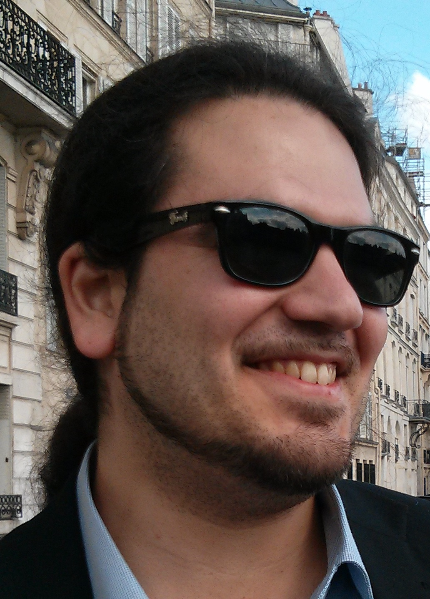

> Knowledge Shared = Knowledge2

The AI4Science Colloquium is a bi-weekly colloquium series, held on alternating Tuesdays at 14:00 Central European Time. In this colloquium our very own Teodora Pandeva and Fiona Lippert invite renowned speakers to present and discuss their state-of-the-art AI solutions for scientific discovery. Interested? Subscribe to our Email-list to be notified.

## Email List
To stay up to date with our activities and be invited to our biweekly AI4Science colloquium series, you may send a request to be included in our emaillist via [an email to us][9] with your name, affiliation and a one-sentence motivation for joining.

## Next Colloquium

#### Deep Gaussian Markov Random Fields

Date: 25-10-2022 14:00-1500 Central European Summer time

 

Speaker: **Fredrik Lindsten**, Linköping University

**Abstract:**  

Machine learning methods on graphs are relevant for many application domains due to their ability to model complex dependencies and structures. Gaussian Markov Random Fields (GMRFs) provide a principled way to define Gaussian models on graphs by utilizing their sparsity structure. In this talk I will show how we can use graph neural networks (GNNs) and convolutional neural networks (CNNs) do design scalable and flexible GMRFs. Starting with lattice graphs, we establish a formal connection between CNNs and GMRFs, by showing that common GMRFs are special cases of a generative model where the inverse mapping from data to latent variables is given by a 1-layer linear CNN. This connection allows us to generalize GMRFs to multi-layer CNN architectures, effectively increasing the order of the corresponding GMRF in a way which has favorable computational scaling. I will also discuss how this Deep GMRF can be generalized to arbitrary graphs using a specialized GNN layer. Well-established tools, such as autodiff and variational inference, can be used for simple and efficient inference and learning of the Deep GMRF, and for a Gaussian likelihood, close to exact Bayesian inference is available for the latent field. I demonstrate the flexibility of the proposed model and show that it compares favorably to other methods, both Bayesian and deep-learning-based, on spatial and non-spatial data.

Joint work with Joel Oskarsson (LiU) and Per Sidén (LiU/Qualcomm Arriver)

Papers:

[Deep Gaussian Markov Random Fields][10]

[Scalable Deep Gaussian Markov Random Fields for General Graphs][11]

## Schedule

- 18 January 2022 - **Andrew Ferguson**
- 7 February 2022 - **Jan-Matthis Lückmann** 
- 1 March 2022 - **Martin van Hecke**
- 15 March 2022 - **Rajesh Ranganath**
- 29 March 2022 - **Anna Scaife**
- 12 April 2022 - **Gabriel Vivó-Truyols**
- 26 April 2022 - **Maximilian Dax**
- 24 May 2022 - **Francesca Grisoni**
- 7 June 2022 - **Wujie Wang**
- 21 June 2022 - **Peter Grünwald**
- 5 July 2022 - **Michele Ceriotti**
- 11 October 2022 - **Guy Wolf**
- 25 October 2022 - **Fredrik Lindsten**

## Previous Colloquium

#### Geometry-based Data Exploration
Date: 11-10-2022 14:00-1500 Central European Summer time

 

Speaker: **Guy Wolf**, Université de Montréal

**Abstract:**  

High-throughput data collection technologies are becoming increasingly common in many fields, especially in biomedical applications involving single cell data (e.g., scRNA-seq and CyTOF). These introduce a rising need for exploratory analysis to reveal and understand hidden structure in the collected (high-dimensional) Big Data. A crucial aspect in such analysis is the separation of intrinsic data geometry from data distribution, as (a) the latter is typically biased by collection artifacts and data availability, and (b) rare subpopulations and sparse transitions between meta-stable states are often of great interest in biomedical data analysis. In this talk, I will show several tools that leverage manifold learning, graph signal processing, and harmonic analysis for biomedical (in particular, genomic/proteomic) data exploration, with emphasis on visualization, data generation/augmentation, and nonlinear feature extraction. A common thread in the presented tools is the construction of a data-driven diffusion geometry that both captures intrinsic structure in data and provides a generalization of Fourier harmonics on it. These, in turn, are used to process data features along the data geometry for denoising and generative purposes. Finally, I will relate this approach to the recently-proposed geometric scattering transform that generalizes Mallat's scattering to non-Euclidean domains, and provides a mathematical framework for theoretical understanding of the emerging field of geometric deep learning.

**Bio:** 
Guy Wolf is an associate professor in the Department of Mathematics and Statistics (DMS) at the Université de Montréal (UdeM), a core academic member of Mila (the Quebec AI institute), and an associate researcher with CRCHUM (the Montreal university hospital research center). He is also affiliated with the IVADO institute of data valorization. He holds an M.Sc. and a Ph.D. in computer science from Tel Aviv University. Prior to joining UdeM, he was a postdoctoral researcher (2013-2015) in the Department of Computer Science at École Normale Supérieure in Paris (France), and a Gibbs Assistant Professor (2015-2018) in the Applied Mathematics Program at Yale University. Between 2004 and 2009 he served in the Israeli Defense Forces in IT software design and development roles related to data analysis and visualization. His research focuses on manifold learning and geometric deep learning for exploratory data analysis, including methods for dimensionality reduction, visualization, denoising, data augmentation, and coarse graining. Further, he is particularly interested in biomedical data exploration applications of such methods, e.g., in single cell genomics/proteomics and neuroscience.

<!--
<a class="radius button small" href="https://drive.google.com/file/d/1piVbnetRwbMxMFyVIgoq1cOvAw3BlqBP/view?usp=sharing">Watch Back ›</a>
-->

For an overview of more  previous colloquia, please have a look at out [blog][2].

[1]: https://bereau.group/
[2]: /blog/
[9]: /contact/
[3]:https://github.com/undark-lab/swyft
[4]:https://arxiv.org/abs/2011.13951
[5]:http://www.mathben.com/
[6]:https://pubs.acs.org/doi/10.1021/acs.jctc.0c00981
[7]:https://github.com/Ensing-Laboratory/FABULOUS
[8]:www.evozyne.com
[10]:https://arxiv.org/abs/2002.07467
[11]:https://arxiv.org/abs/2206.05032

