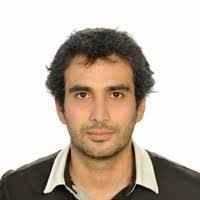

> Knowledge Shared = Knowledge2

The AI4Science Colloquium is a bi-weekly colloquium series, held on alternating Tuesdays at 14:00 Central European Time. In this colloquium our very own Teodora Pandeva and Fiona Lippert invite renowned speakers to present and discuss their state-of-the-art AI solutions for scientific discovery. Interested? Subscribe to our Email-list to be notified.

## Email List
To stay up to date with our activities and be invited to our biweekly AI4Science colloquium series, you may send a request to be included in our emaillist via [an email to us][9] with your name, affiliation and a one-sentence motivation for joining.

## Next Colloquium

#### To be announced

Date: 26-10-2021 14:00-1500 Central European Summer time

 

Speaker: **Jan-Willem van de Meent**, "Associate Professor (UHD), AMLab, University of Amsterdam"

**Abstract:**  

To be announced.

## Schedule

- 9 November 2021 - **Jan-Willem van de Meent**
- 23 November 2021 - **Chris Rackauckas**
- 7 December 2021 - **Atılım Güneş Baydin**
- 18 January 2022 - **Andrew Ferguson**
- 1 February 2022 - **Jan-Matthis Lückmann**

## Previous Colloquium

#### Machine Learning and High Resolution Mass Spectrometry

Date: 31-08-2021 14:00-1500 Central European Summer time

 

Speaker: **Saer Samanipour**, Assistant Professor at the University of Amsterdam and honorary research fellow at the UQ, Australia

**Abstract:**  

High resolution mass spectrometry is one of the main tools for chemical characterization of complex samples. The samples analyzed with this instrument result into large datasets comprising of up to 8.0e12 variables that could potentially carry crucial structural information about the sample chemistry. At the same time there are different sources of signal redundancy in such datasets. In this talk I will present two case studies where machine learning enables the removal of the data redundancy without any information loss. The first case study will discuss the seamless conversion from the profile mode to centroided and vice versa. In this case, we developed a self adjusting centroiding algorithm to detect and extract the meaningful information in such complex datasets. Additionally, a regression model was developed to convert the extracted information to the raw data. The second case study, is related to the development of a stochastic classification model to detect the isotopic signal in the mass spectra and therefore increase the level of confidence in the generated identifications.

<!-- 
<a class="radius button small" href="https://drive.google.com/file/d/1IZsF5hh3TPpZmp9DtmgYR6JJNX6vZsoL/view?usp=sharing">Watch Back ›</a>
-->

For an overview of more  previous colloquia, please have a look at out [blog][2].

[1]: https://bereau.group/
[2]: /blog/
[9]: /contact/
[3]:https://github.com/undark-lab/swyft
[4]:https://arxiv.org/abs/2011.13951
[5]:http://www.mathben.com/
[6]:https://pubs.acs.org/doi/10.1021/acs.jctc.0c00981
[7]:https://github.com/Ensing-Laboratory/FABULOUS

