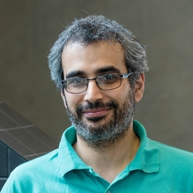

> Knowledge Shared = Knowledge2

The AI4Science Colloquium is a bi-weekly colloquium series, held on alternating Tuesdays at 14:00 Central European Time. In this colloquium our very own Teodora Pandeva and Fiona Lippert invite renowned speakers to present and discuss their state-of-the-art AI solutions for scientific discovery. Interested? Subscribe to our Email-list to be notified.

## Email List
To stay up to date with our activities and be invited to our biweekly AI4Science colloquium series, you may send a request to be included in our emaillist via [an email to us][9] with your name, affiliation and a one-sentence motivation for joining.

## Next Colloquium

#### Machine Learning and High Resolution Mass Spectrometry

Date: 31-08-2021 14:00-1500 Central European Summer time

 

Speaker: **Saer Samanipour**, Assistant Professor at the University of Amsterdam and honorary research fellow at the UQ, Australia

**Abstract:**  

High resolution mass spectrometry is one of the main tools for chemical characterization of complex samples. The samples analyzed with this instrument result into large datasets comprising of up to 8.0e12 variables that could potentially carry crucial structural information about the sample chemistry. At the same time there are different sources of signal redundancy in such datasets. In this talk I will present two case studies where machine learning enables the removal of the data redundancy without any information loss. The first case study will discuss the seamless conversion from the profile mode to centroided and vice versa. In this case, we developed a self adjusting centroiding algorithm to detect and extract the meaningful information in such complex datasets. Additionally, a regression model was developed to convert the extracted information to the raw data. The second case study, is related to the development of a stochastic classification model to detect the isotopic signal in the mass spectra and therefore increase the level of confidence in the generated identifications.

## Schedule

- 31 August 2021 - **Saer Samanipour**
- 14 September 2021 - **TBA**
- 28 September 2021 - **TBA**

## Previous Colloquium

#### Can artificial intelligence help understand and predict molecular dynamics?

Date: 22-06-2021 14:00-1500 Central European Summer time

 

Speaker: **Pratyush Tiwary**, Asst. Prof University of Maryland, Washington DC

**Abstract:**  
The ability to rapidly learn from high-dimensional data to make reliable predictions about the future is crucial in many contexts. This could be a fly avoiding predators, or the retina processing terabytes of data guiding complex human actions. Modern day artificial intelligence (AI) aims to mimic this fidelity and has been successful in many domains of life. It is tempting to ask if AI could also be used to understand and predict the dynamics of complex molecules with millions of atoms. In this talk I will show that certain flavors of AI can indeed help us understand generic molecular dynamics and also predict it even in situations with arbitrary long memories. However this requires close integration of AI with old and new ideas in statistical mechanics. I will talk about such methods developed by my group (1-3). I will demonstrate the methods on different problems, where we predict mechanisms at timescales much longer than milliseconds while keeping all-atom/femtosecond resolution. These include ligand dissociation from flexible protein/RNA and crystal nucleation with competing polymorphs. I will conclude by discussing some generic challenges and  solutions regarding reliability, interpretability and extrapolative powers of AI when used to guide and complement simulations and perhaps even experiments in chemistry.

References: 
1. Wang, Y., Ribeiro, J.M.L. & Tiwary, P. Past–future information bottleneck for sampling molecular reaction coordinate simultaneously with thermodynamics and kinetics. Nat. Commun. 10, 3573 (2019). 
2. Tsai, S.T, Kuo, E.J. & Tiwary, P.  Learning Molecular Dynamics with Simple Language Model built upon Long Short-Term Memory Neural Network. Nat. Commun. 11, 5115 (2020).
3. Wang, Y., Ribeiro, J.M.L. and Tiwary, P. Machine learning approaches for analyzing and enhancing molecular dynamics simulations. Curr. Op. Sruc. Bio., 61, 139 (2020).
 
 <!--
 <a class="radius button small" href="https://drive.google.com/file/d/1nOuQ4naUpI4C0ee85xJQ_WAe_qk1MDhk/view?usp=sharing">Watch Back ›</a>
-->

For an overview of more  previous colloquia, please have a look at out [blog][2].

[1]: https://bereau.group/
[2]: /blog/
[9]: /contact/
[3]:https://github.com/undark-lab/swyft
[4]:https://arxiv.org/abs/2011.13951
[5]:http://www.mathben.com/
[6]:https://pubs.acs.org/doi/10.1021/acs.jctc.0c00981
[7]:https://github.com/Ensing-Laboratory/FABULOUS

