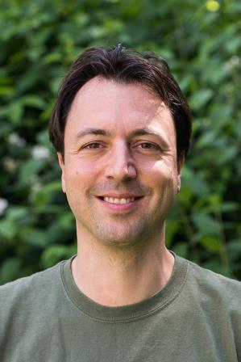

> Knowledge Shared = Knowledge2

The AI4Science Colloquium is a bi-weekly colloquium series, held on alternating Tuesdays at 14:00 Central European Time. In this colloquium our very own Teodora Pandeva and Fiona Lippert invite renowned speakers to present and discuss their state-of-the-art AI solutions for scientific discovery. Interested? Subscribe to our Email-list to be notified.

## Email List
To stay up to date with our activities and be invited to our biweekly AI4Science colloquium series, you may send a request to be included in our emaillist via [an email to us][9] with your name, affiliation and a one-sentence motivation for joining.

## Next Colloquium

#### Title: Machine learning the formation of dark matter halos in the Universe 

Date: 24-11-2020 14:00-15:00 Central European Summer Time

 

Speaker: **Luisa Lucie-Smith**, PhD Student, Department of Physics and Astronomy, University college London

**Abstract:**  
Dark matter halos are the fundamental building blocks of cosmic large-scale structure. Improving our theoretical understanding of their evolution and formation is an essential step towards understanding how galaxies form. I will present a deep learning model, based on 3D convolutional neural networks (CNNs), trained to learn the mapping between the initial conditions and the final dark matter halos of an N-body simulation. The CNN is able to extract directly from the initial density field the features that are relevant to halo formation. Our goal is to utilize machine learning for knowledge extraction: we aim to gain new physical understanding of halo formation by extracting information from the deep learning model regarding the underlying physics of halo collapse. To do this, we first compare the performance of the deep learning algorithm to that of machine learning models whose predictions depend only on physically-motivated features extracted from the initial conditions. I will then present ongoing work on interpreting the features learnt by the deep learning model in relation to physical properties of the initial conditions.

<!--

Ref: <a href="https://aip.scitation.org/doi/10.1063/1.5009502">Journal of Chemical Physics</a>

-->

## Schedule
* 24 November 2020 - **Luisa Lucie-Smith**

## Previous Colloquia

#### Title: Boltzmann-generating Flows

Date: 10-11-2020 14:00-15:00 Central European Summer Time

 

Speaker: **Frank Noé**, Professor, Freie Universität Berlin

**Abstract:**  
Frank Noé will talk about the sampling problem of many-body physics systems and introduce some statistics and machine-learning methods to tackle it. In particular, he will make an introduction to Boltzmann-generating flows, a combination of normalizing flows and statistical-mechanics-based reweighting, and stochastic normalizing flows. Some open questions and unsolved machine-learning problems related to Boltzmann-generating flows will be presented.

<!--

Ref: <a href="https://aip.scitation.org/doi/10.1063/1.5009502">Journal of Chemical Physics</a>

-->
 
<a class="radius button small" href="https://drive.google.com/file/d/14k33ukgDE3bciV7ELQB3X5hkgxp5A8b4/view?usp=sharing">Watch Back ›</a>

For an overview of more  previous colloquia, please have a look at out [blog][2].

[1]: https://bereau.group/
[2]: /blog/
[9]: /contact/
