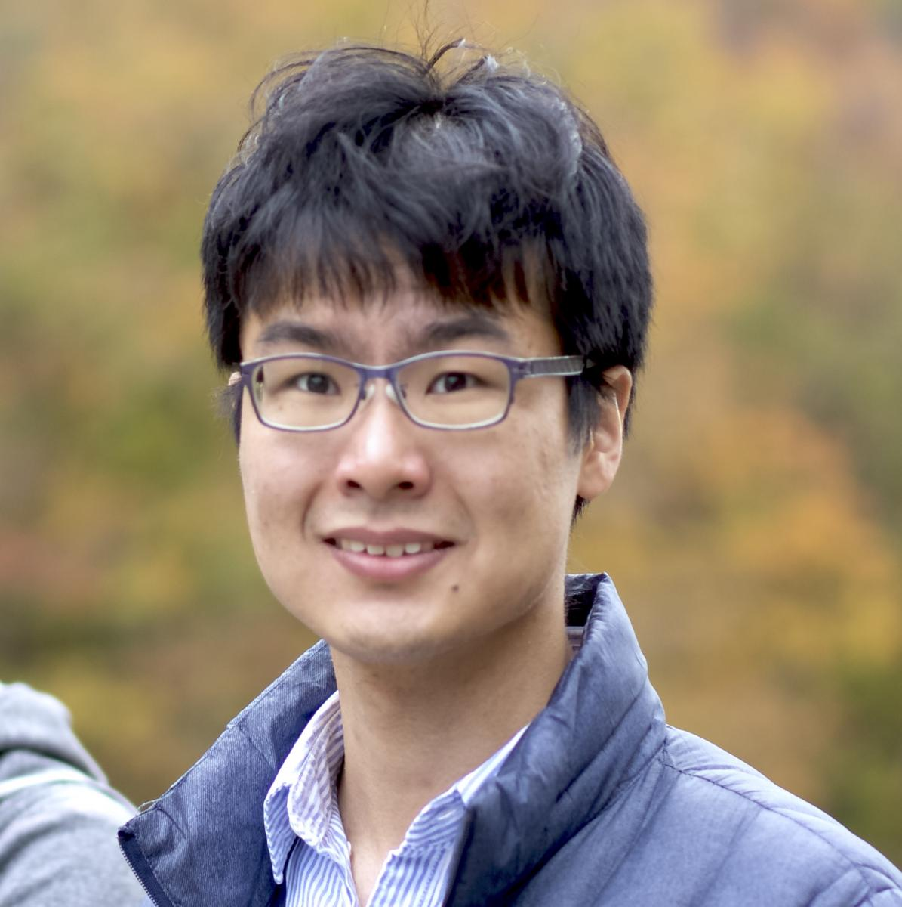

> Knowledge Shared = Knowledge2

The AI4Science Colloquium is a bi-weekly colloquium series, held on alternating Tuesdays at 14:00 Central European Time. In this colloquium our very own Teodora Pandeva and Fiona Lippert invite renowned speakers to present and discuss their state-of-the-art AI solutions for scientific discovery. Interested? Subscribe to our Email-list to be notified.

## Email List
To stay up to date with our activities and be invited to our biweekly AI4Science colloquium series, you may send a request to be included in our emaillist via [an email to us][9] with your name, affiliation and a one-sentence motivation for joining.

## Next Colloquium

#### Title: To be announced.

Date: 21-06-2022 14:00-1500 Central European Summer time

 

Speaker: **Peter Grünwald**, CWI

**Abstract:**  

To be announced.

## Schedule

- 18 January 2022 - **Andrew Ferguson**
- 7 February 2022 - **Jan-Matthis Lückmann** 
- 1 March 2022 - **Martin van Hecke**
- 15 March 2022 - **Rajesh Ranganath**
- 29 March 2022 - **Anna Scaife**
- 12 April 2022 - **Gabriel Vivó-Truyols**
- 26 April 2022 - **Maximilian Dax**
- 24 May 2022 - **Francesca Grisoni**
- 7 June 2022 - **Wujie Wang**
- 21 June 2022 - **Peter Grünwald**
- 5 July 2022 - **Michele Ceriotti**
- 19 July 2022 - **Miguel Bessa**

## Previous Colloquium

#### Generative Coarse-Graining of Molecular Conformations

Date: 07-06-2022 14:00-1500 Central European Summer time

 

Speaker: **Wujie Wang**, MIT

**Abstract:**  

Coarse-graining (CG) of molecular simulations simplifies the particle representation by grouping selected atoms into pseudo-beads and therefore drastically accelerates simulation. However, such CG procedure induces information losses, which makes accurate backmapping, i.e., restoring finegrained (FG) coordinates from CG coordinates, a long-standing challenge. Inspired by the recent progress in generative models and equivariant networks, we propose a novel model that rigorously embeds the vital probabilistic nature and geometric consistency requirements of the backmapping transformation. Our model encodes the FG uncertainties into an invariant latent space and decodes them back to FG geometries via equivariant convolutions. To standardize the evaluation of this domain, we further provide three comprehensive benchmarks based on molecular dynamics trajectories. Extensive experiments show that our approach always recovers more realistic structures and outperforms existing data-driven methods with a significant margin.

<a class="radius button small" href="https://drive.google.com/file/d/1nvc1Gr9vJ-NGJkWcPmuRKEwG1o5Wwvbe/view?usp=sharing">Watch Back ›</a>

For an overview of more  previous colloquia, please have a look at out [blog][2].

[1]: https://bereau.group/
[2]: /blog/
[9]: /contact/
[3]:https://github.com/undark-lab/swyft
[4]:https://arxiv.org/abs/2011.13951
[5]:http://www.mathben.com/
[6]:https://pubs.acs.org/doi/10.1021/acs.jctc.0c00981
[7]:https://github.com/Ensing-Laboratory/FABULOUS
[8]:www.evozyne.com
