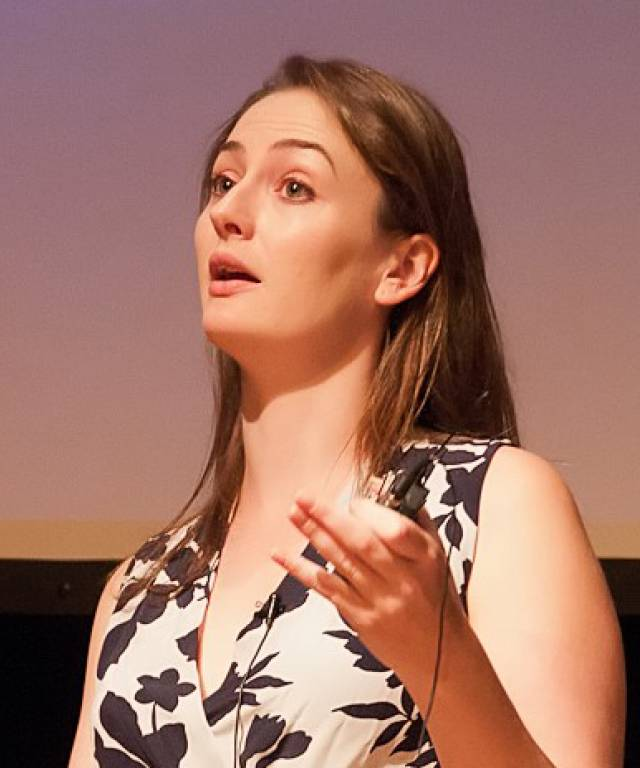

> Knowledge Shared = Knowledge2

The AI4Science Colloquium is a bi-weekly colloquium series, held on alternating Tuesdays at 14:00 Central European Time. In this colloquium our very own Teodora Pandeva and Fiona Lippert invite renowned speakers to present and discuss their state-of-the-art AI solutions for scientific discovery. Interested? Subscribe to our Email-list to be notified.

## Email List
To stay up to date with our activities and be invited to our biweekly AI4Science colloquium series, you may send a request to be included in our emaillist via [an email to us][9] with your name, affiliation and a one-sentence motivation for joining.

## Next Colloquium

#### Title: To be announced
Date: 15-03-2022 14:00-1500 Central European Winter time

 

Speaker: **Rajesh Ranganath**, NYU

**Abstract:**  

To be announced

<!---
#### Title: To be announced

Date: 15-02-2022 14:00-1500 Central European Winter time

 

Speaker: **Anna Scaife**, Professor of Radio Astronomy at the University of Manchester and Head of the Jodrell Bank Centre for Astrophysics Interferometry Centre of Excellence

**Abstract:**  

To be announced.

-->
## Schedule

- 18 January 2022 - **Andrew Ferguson**
- 7 February 2022 - **Jan-Matthis Lückmann** 
- 15 February 2022 - **Anna Scaife**
- 1 March 2022 - **Martin van Hecke**
- 15 March 2022 - **Rajesh Ranganath**
- 29 March 2022 - **Anna Scaife**
- 12 April 2022 - **Gabriel Vivó-Truyols**
- 26 April 2022 - **Maximilian Dax**
- 24 May 2022 - **Francesca Grisoni**

## Previous Colloquium

#### Machine Learning of Combinatorial Rules in Mechanical Metamaterials

Date: 01-03-2022 14:00-1500 Central European Winter time

 

Speaker: **Martin van Hecke**, Leiden University

**Abstract:**  

Combinatorial problems arising in puzzles, origami, and (meta)material design have rare sets of
solutions, which define complex and sharply delineated boundaries in configuration space. These
boundaries are difficult to capture with conventional statistical and numerical methods. Here we
show that convolutional neural networks can learn to recognize these boundaries, down to finest de-
tail, despite using heavily undersampled training sets, and can successfully generalize. This suggests
that the network infers the underlying combinatorial rules from the sparse training set, opening up
new possibilities for complex design of (meta)materials.

<a class="radius button small" href="https://drive.google.com/file/d/1PryMUuxAw09Flpfa9J0Z7m4cQexa3Q5G/view?usp=sharing">Watch Back ›</a>

For an overview of more  previous colloquia, please have a look at out [blog][2].

[1]: https://bereau.group/
[2]: /blog/
[9]: /contact/
[3]:https://github.com/undark-lab/swyft
[4]:https://arxiv.org/abs/2011.13951
[5]:http://www.mathben.com/
[6]:https://pubs.acs.org/doi/10.1021/acs.jctc.0c00981
[7]:https://github.com/Ensing-Laboratory/FABULOUS
[8]:www.evozyne.com

