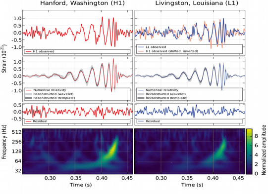
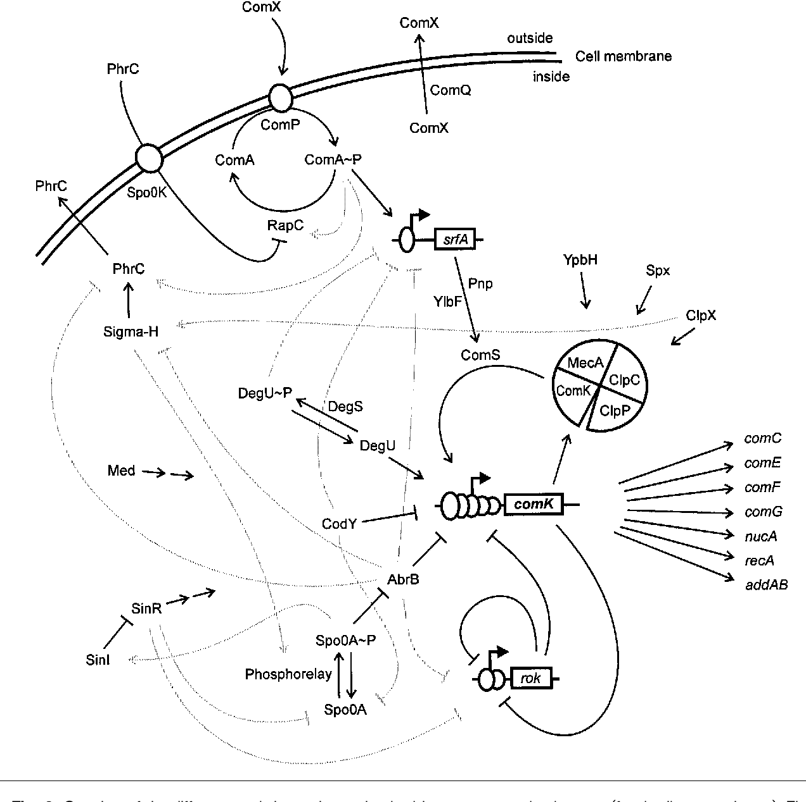
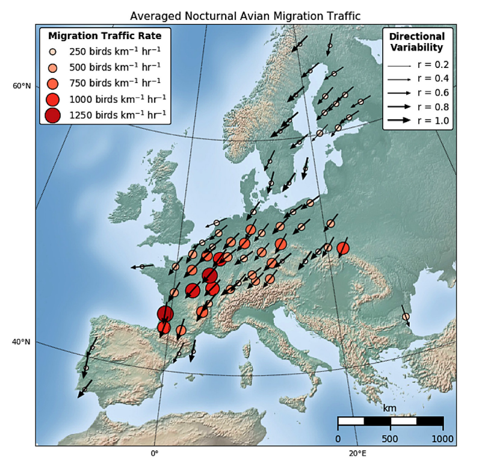
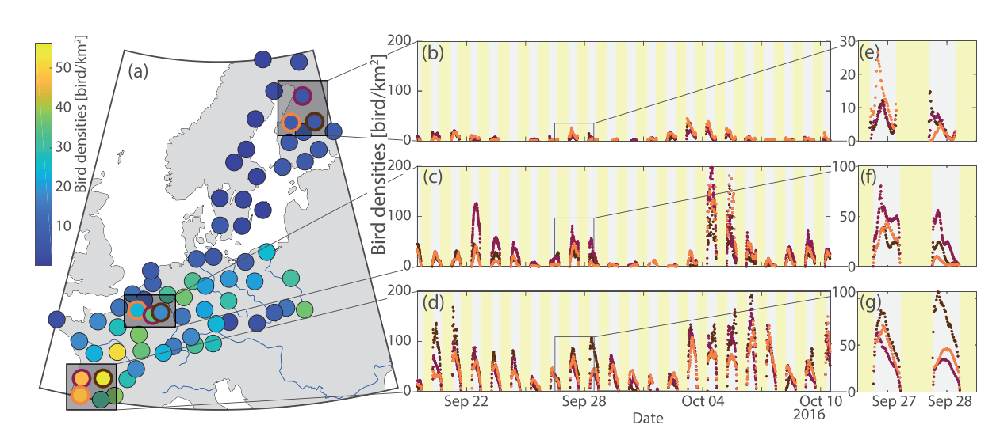
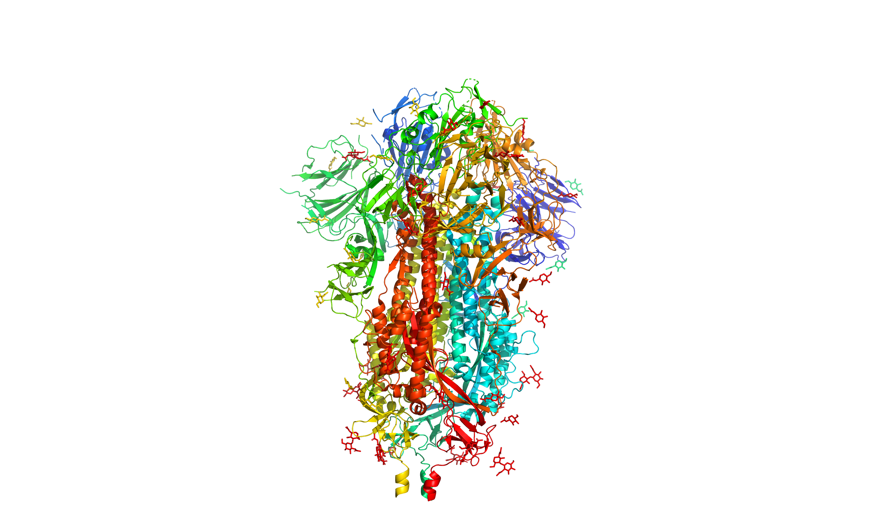
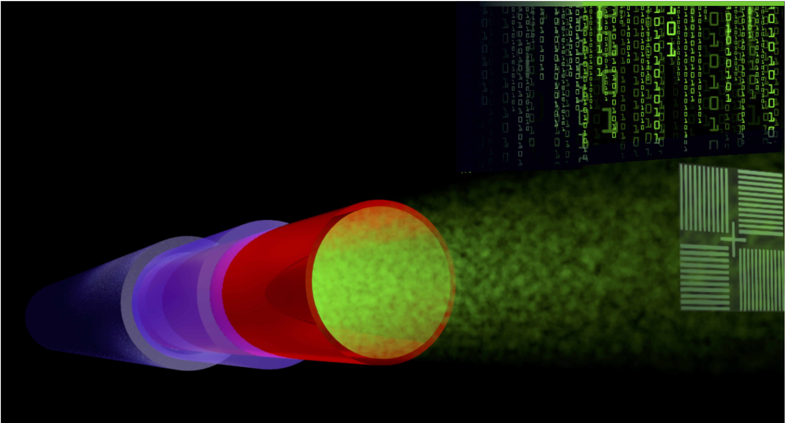
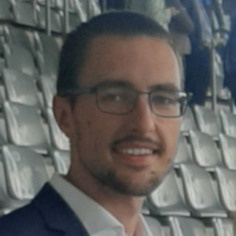

 <h1>Research</h1> 

	
## Gravitational Waves
 

The breakthrough discovery of the first gravitational wave signal in September 2015 (Nobel Prize 2017) has opened a new window to the Universe. Analyses of the signal waveforms during the initial inspiral, merger and final ringdown phase provide crucial information about the properties of superheavy stellar objects.

 By Benjamin Miller 

  

----------------------------------------------

## Liquid Chromatography
 

Two-dimensional liquid chromatography (2DLC) is a powerful technique to separate and detect trace molecular compounds in complex samples (think of proteins, antibodies, oils, paints, etc.). The separation is based on the difference in "retention" time that it takes for each compound to be carried by a solvent (mobile phase) through a column filled with a material (stationary phase) that interacts with the injected compounds based on a chosen property, such as molecular size, charge or hydrophilicity, as schematically drawn on the right. 2DLC is combined with a detection method such as UV-VIS, IR, or mass spectroscopy (MS), that identifies the separated molecules. As the compounds can have extremely low concentrations (e.g. protein biomarkers, plant hormones, food contaminants), the signals of interest are often buried in the noise of the data and information is being lost. Typical datasets contain several gigabytes of data per measurement.

Analyzing and extracting all relevant information from such data is a challenging task. In addition, 2DLC method development is daunting as there are numerous parameters one can vary in order to achieve optimal separation. Successful implementation of the technique requires months of costly and cumbersome development. In response to this, algorithms are being developed to model chromatographic interaction of analyte molecules with the chemical moieties of the stationary phase, so as to allow prediction of optimal chromatographic conditions. In this project, we will look at the application of AI techniques, such as Bayesian inference, Bayesian optimization and deep learning to tackle parameter optimization, peak detection, baseline correction, and more.

 By Jim Boelrijk

  

--------------------------------------------

## Radio Astronomy
 

One of the cutting edge areas of astronomy is recognising rare features in data streams in near-real time. This problem has arisen from massive imaging surveys of the sky at many wavelengths (optical, radio, X-ray). The purpose is no longer just to find objects that are there all or most of the time, but to find so-called ‘transient’ objects that appear fleetingly in hindsight.

These transients are typically multi-messenger events, meaning that their emission is seen throughout the electromagnetic spectrum and using other ‘messengers’ including neutrinos and gravitational waves. By combining the multi-messenger observations, we can probe the most extreme physical environments in the universe. However, we are not monitoring the whole sky all the time with sensitive observatories, so we need to alert them to interesting objects in order to trigger follow-up observations. As these events are often fleeting at different wavelengths, we need to trigger the follow-up in as close to real-time as possible.

Due to the nature of our searches, we cannot always predict the transient behaviour we are searching for, nor all more rare specific instrumental faults in the data stream. The real-time data streams are subject to different types of behaviour, which we do not want to confuse with astrophysical transient events, including radio frequency interference, calibration artefacts, varying noise features, space weather, meteors, airplanes and satellites.

There are multiple areas where ML can assist with solving the task at hand and the challenges it comes with. Examples are: finding latent (disentangled) representations of observed phenomena, undoing data corruption (e.g. denoising), unsupervised outlier detection, geometric deep learning. The project will explore the application and innovation of these techniques and will push the boundaries of machine learning and astronomy.

 By David Ruhe  

--------------------------------------------

## Gene Regulatory Networks

 

Causal discovery to reveal complex gene regulation networks from vast transcriptome datasets
Gene regulatory networks (GRNs) model the biological interactions between genes and provide a better understanding of the cellular processes and regulation pathways. Correctly constructed GRNs can play a fundamental role in solving various biological and biomedical problems, such as tracking disease development. Technological advances of high-throughput molecular biology have opened a new research frontier for inferring GRNs in a completely data-driven way. The great amount of gene expression data available on the GEO database suggests using AI-based techniques for processing and modeling such networks.
In this project, we focus on Bacillus subtilis, a well-studied Gram-positive bacterium with more than 3,000 publicly available transcriptome datasets. Combining these datasets alongside with reconstructing the known GRNs can be a very challenging task due to the (un)observable batch effects in the data that result from the varying data generating process across experiments. By tackling these issues and applying novel causal discovery techniques we aim for a better interpretation of the genes functions and their organization in hierarchical structures or even revealing unknown regulatory networks.

By Teodora Pandeva

--------------------------------------------

## Radar Aeroecology

 

Every year millions of birds travel hundreds if not thousands of kilometers between their breeding and wintering grounds, seeking for seasonally optimal habitats. These mass movements are an essential component of biodiversity as they link otherwise separated ecosystems. Climate change and rapid expansions of human structures and activities may have severe implications for migrating birds. In order to assess the ecological consequences of these developments and to devise measures to preserve migration systems, it is essential to better understand continental-scale migration patterns and its external drivers such as weather, habitat quality and land use.

However, studying the aerial movement of migrating birds on a large scale is challenging. Many birds migrate during the night or at high altitudes which makes it impossible for humans to observe them from the ground. Modern tracking devices overcome this issue but they are limited to very few individuals and species with sufficient body mass. Radar technology is considered a promising alternative. In particular international networks of weather radars, which are known to capture mass movements of migrating birds, offer unparalleled opportunities to quantify and analyze bird migration at large spatial and temporal scales. But the field of radar aeroecology is still in its infancy. Challenges relating to the mere volume of raw radar observations as well as data quality issues such as inconsistent calibration and preprocessing, observation artifacts and partial observability prevent ecologists from utilizing the full potential of available radar databases.

This project will explore the use of machine learning to overcome this hurdle. By applying and advancing techniques for system identification and predictive modeling of partially observed spatio-temporal dynamical systems we aim at enhancing both the understanding and predictability of continental-scale bird migration in Europe.

By Fiona Lippert

Images from:

[Nilsson et al. (2018) Revealing patterns of nocturnal migration using the European weather radar network][2] 

[Nussbaumer et al. (2019) A Geostatistical Approach to Estimate High Resolution Nocturnal Bird Migration Densities from a Weather Radar Network][1]

--------------------------------------------

## Protein Stabilization for Vaccine Design

 

Highly contagious viruses, such as SARS-CoV-2, can have a negative impact on the health of people and the stability of social resources. Vaccines are an effective means of stopping the widespread spread of viruses in the population by giving people immunity to a particular virus, thereby stopping them from spreading the virus and protecting those at risk of being infected. One of the core aspects of vaccine development is the development of antigens. One of the ways in which antigens are developed is by mutating one/some of the amino acids in the antigen, thus making the antigen stable, which in turn triggers an immune response and the production of a large number of antibodies.
Among the methods for finding a viable antigen, the structural based approach has worked well and is widely used. However, their success rate for single point variants is only 5% to 10%. As a result, it can take a considerable amount of time to design a stable antigen that is feasible with multiple variants. Thanks to the large amount of available protein structure/sequence data, deep learning-based approaches have recently achieved unprecedented success in research for proteins, e.g. protein property prediction and protein structure prediction. In this project, our goal is to apply the cutting-edge deep learning methods (e.g. Graph Neural Networks, Transformers, Equivariant Neural Networks, AlphaFold2 etc…) to model our problems. Allowing the model to suggest variant sites and variant amino acids for antigens with correspondingly predicted stabilities, leading to the help for designing of stable antigens.

 By Cong Liu

--------------------------------------------

## Imaging and Metrology for Semiconductors 

 

The ever-increasing computational power and ever-shrinking size of electronic devices have been enabled by rapid developments in optical lithography and the micro-electronics industry. State-of-the-art processors require reliable and fast nanoscale engineering methods with high production efficiency. The widespread access to computational power has already made a big impact on our daily lives. New future applications like VR, AR or AI technologies require even smaller and more powerful hardware. However, keeping up with the aggressive reduction of the semiconductor device feature sizes is a challenging task.

In this project, we will explore deep learning and Bayesian optimization techniques to push the boundaries of compact semiconductor metrology tools. Label-free optical imaging methods with a spatial resolution beyond the Abbe diffraction limit and a temporal resolution beyond the Nyquist limit are being developed to characterize multi-layer nanostructures. Several modern research areas such as computational imaging and compressive sensing are connected with cutting-edge Machine Learning tools to develop new methods of nanoscale imaging and metrology for the semiconductor industry. The project is running in collaboration with the Advanced Research Center for Nanolithography (ARCNL) and ASML, the world leader in the production of the lithography machines.

 By Maximilian Lipp

--------------------------------------------

[1]: https://doi.org/10.1111/ecog.04003
[2]: https://www.mdpi.com/2072-4292/11/19/2233 
