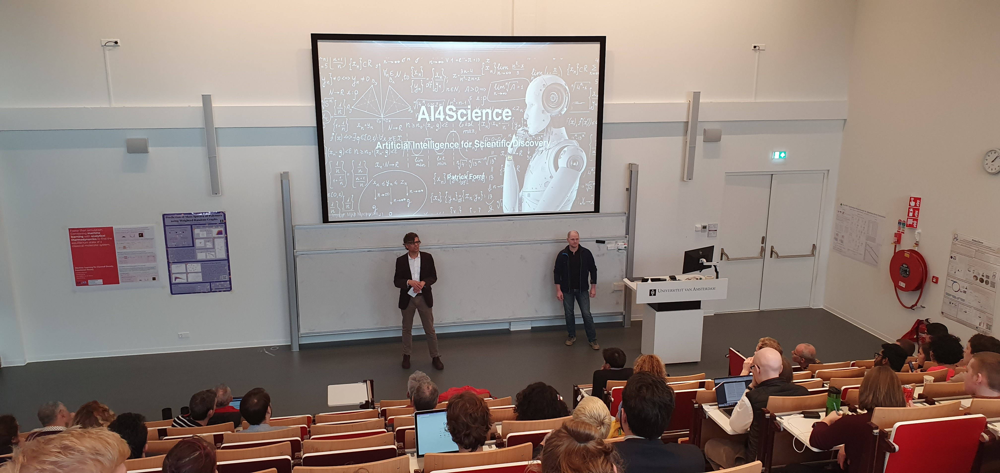
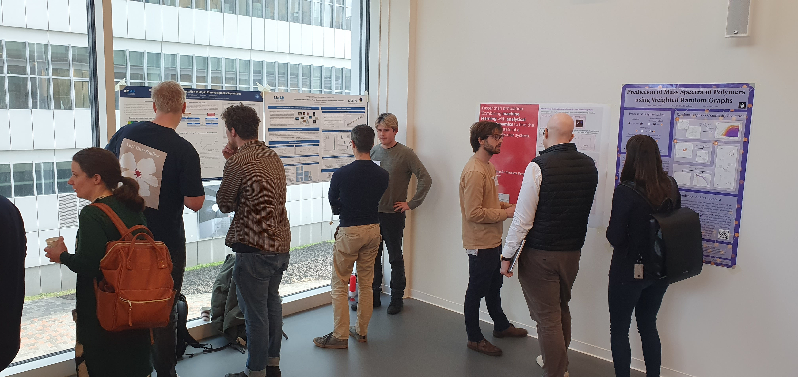
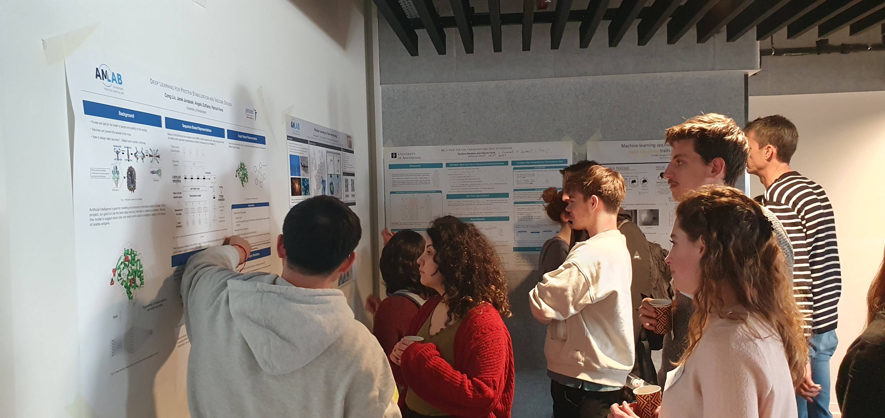
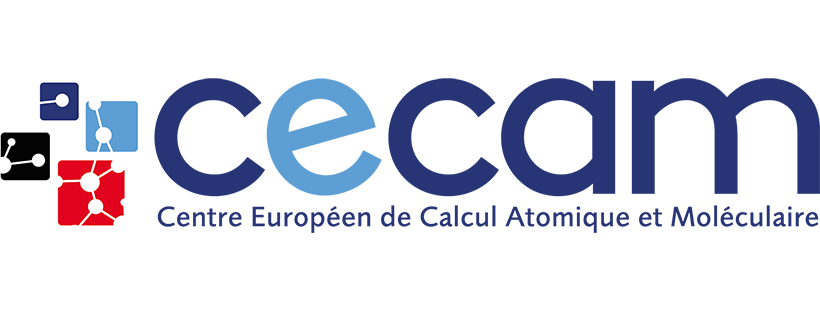

Artificial intelligence and machine learning are rapidly finding their
way into the natural sciences, where they are applied for the analysis of
research data, finding patterns and making predictions. At the same
time, research topics and methodologies initiate the study and development of
new machine learning algorithms. The co-development of both fields is
self-catalyzed by the shared interest in building accurate models and
distribution functions of the highly complex phenomena of nature.

The aim of this AI4Science Symposium was three-fold: (1) show-case
recent progress of artificial intelligence for scientific discovery within
the different FNWI research institutes and outside, (2) bring AI experts and
scientists together to exchange ideas, and (3) explore possibilities for
new collaborations, research projects, and funding opportunities.

Six scientists connected to the different FNWI institutes gave
lectures on how artificial intelligence is advancing their scientific
research. During the poster sessions, young and senior researchers
 presented their results and discuss opportunities for AI models or
scientific research. The symposium concluded with drinks and snacks.

The symposium was open to everyone with an interest in artificial
intelligence for scientific discovery.

### Impression

*Opening of the AI4Science Symposium by our directors Patrick Forré (right) and Bernd Ensing (left)*

*Poster presentations*

*More poster presentations*

### Program:
	
  

| Time           |    Speaker    |
|--------- |---------|
|  13.00 - 13.15   | 	Opening |
|  13.15 - 13.40	|  [Patrick Forré][0] (IvI)   _Past, Present, and Future of the AI4Science Lab_ |
|  13.45 - 14.10	|  [Alberto Pérez de Alba Ortíz][1] ([CSM][6])   _Harnessing ML to Sample, Analyze & Engineer Modes in Molecular & Colloidal Systems_ |
|  14.15 - 13.40	|  [Jean-Michel Désert][8] (API)   _Numerical Tools to Dicepher Exoplanet Atmospheres_  |
|  14.45 - 15.45	|  Posters + coffee break  |
|  15.45 - 16.10	|  [Huub Hoefsloot][2] (SILS)   _How to get Biological Knowledge in a Deep Learner_  |
|  16.15 - 16.40	|  [Daniela Huppenkothen][5] ([SRON][7])   _Inferring the Properties of Black Holes and Neutron Stars with Machine Learning_  |
|  16.45 - 17.10	|  [Saer Samanipour][3] (HIMS) & [Antonia Praetorius][4] (IBED)   _From molecular structure to chemical risk assessment. An AI toolbox towards safe(r) chemicals_  |
|  17.15 - 17.30	|  Conclusions   |
|  17.30 - 19.00	|  Posters + drinks & snacks |

### Organisers

  

* Patrick Forré
* Bernd Ensing

### Sponsors

The AI4Science Lab thanks [CECAM][9], and in particular the
[CECAM-NL][10] node, for financial support of the AI4Science Symposium.

[0]: http://amlab.science.uva.nl/people/PatrickForre/
[1]: https://colloid.nl/people/dr-alberto-perez-de-alba-ortiz/
[2]: http://www.bdagroup.nl/content/People/huub_hoefsloot.php
[3]: https://www.uva.nl/en/profile/s/a/s.samanipour/s.samanipour.html
[4]: https://www.uva.nl/en/profile/p/r/a.praetorius/a.praetorius.html
[5]: https://huppenkothen.org
[6]: https://iop.fnwi.uva.nl/computational_soft_matter
[7]: https://www.sron.nl
[8]: https://www.uva.nl/en/profile/d/e/j.m.l.b.desert/j.m.l.b.desert.html
[9]: https://www.cecam.org
[10]: https://www.cecam.org/cecam-nl

